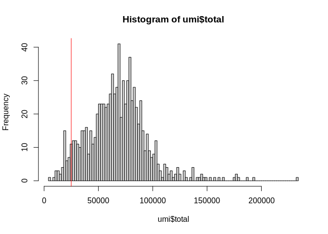
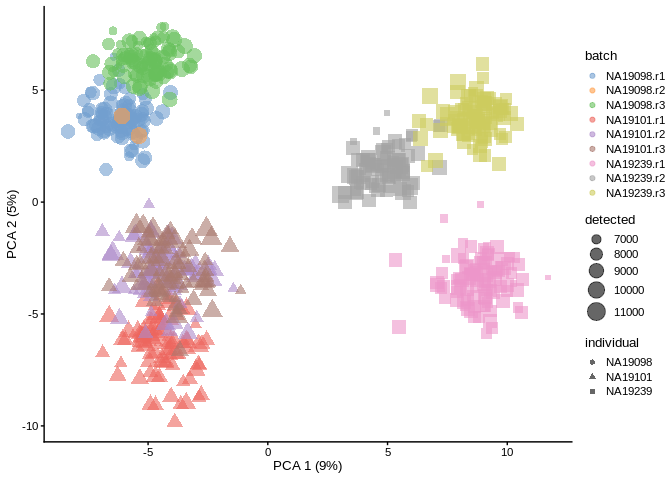
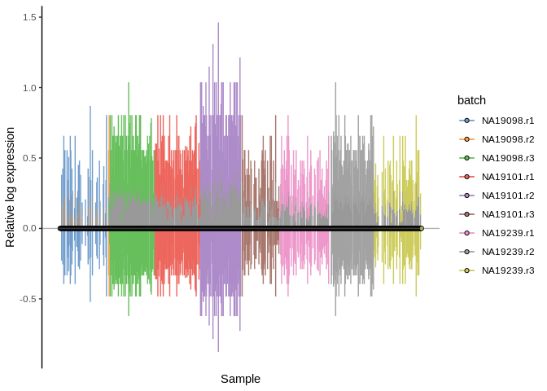

Quality Control (QC) and Exploration of scRNA-seq Datasets
================
2024-09-02

Note: There is no standard method for performing scRNA-seq. QC is mostly
done by looking for cells that are outliers compared to others in the
dataset, i.e., there are no external/independent quality standards.
Should be careful and thoughtful when comparing quality metrics across
datasets collected/sequenced using different protocols.

### Dataset Construction and QC

Load libraries. Use `suppressPackageStartupMessages` so the start up
messages don’t show up.

``` r
suppressPackageStartupMessages(library(scater))
suppressPackageStartupMessages(library(SingleCellExperiment))
suppressPackageStartupMessages(library(AnnotationDbi))
suppressPackageStartupMessages(library(org.Hs.eg.db))
suppressPackageStartupMessages(library(EnsDb.Hsapiens.v86))
```

Load data.

``` r
molecules <- read.delim("course/data/tung/molecules.txt", row.names = 1)
annotation <- read.delim("course/data/tung/annotation.txt",stringsAsFactors = T)
```

Take a look at the data.

``` r
head(molecules[,1:3])
```

    ##                 NA19098.r1.A01 NA19098.r1.A02 NA19098.r1.A03
    ## ENSG00000237683              0              0              0
    ## ENSG00000187634              0              0              0
    ## ENSG00000188976              3              6              1
    ## ENSG00000187961              0              0              0
    ## ENSG00000187583              0              0              0
    ## ENSG00000187642              0              0              0

``` r
head(annotation)
```

    ##   individual replicate well      batch      sample_id
    ## 1    NA19098        r1  A01 NA19098.r1 NA19098.r1.A01
    ## 2    NA19098        r1  A02 NA19098.r1 NA19098.r1.A02
    ## 3    NA19098        r1  A03 NA19098.r1 NA19098.r1.A03
    ## 4    NA19098        r1  A04 NA19098.r1 NA19098.r1.A04
    ## 5    NA19098        r1  A05 NA19098.r1 NA19098.r1.A05
    ## 6    NA19098        r1  A06 NA19098.r1 NA19098.r1.A06

In this dataset, they used both unique molecular identifiers (UMIs) and
ERCC spike-ins. We use `altExp` (alternative Experiment) to separate the
spike-ins from the main dataset.

``` r
umi <- SingleCellExperiment(assays = list(counts = as.matrix(molecules)), colData = annotation)
altExp(umi, "ERCC") <- umi[grep("^ERCC-", rownames(umi)), ]
umi <- umi[grep("^ERCC-", rownames(umi), invert = T), ]
```

Map ENSEMBL IDs to gene symbols.

``` r
gene_names <- mapIds(org.Hs.eg.db, keys=rownames(umi), keytype="ENSEMBL", columns="SYMBOL", column="SYMBOL")
```

    ## 'select()' returned 1:many mapping between keys and columns

mapIds returns one symbol per ID. Using `table` command, find out how
many genes were not annotated.

``` r
rowData(umi)$SYMBOL <- gene_names
table(is.na(gene_names))
```

    ## 
    ## FALSE  TRUE 
    ## 18078   860

Remove genes where no symbols matched.

``` r
umi <- umi[! is.na(rowData(umi)$SYMBOL), ]
```

Check if there are any mitochondrial genes in the newly annotated
symbols.

``` r
grep("^MT-", rowData(umi)$SYMBOL, value = T)
```

    ## named character(0)

Check for ribosomal proteins (starting with “RPL” or “RPS”)

``` r
grep("^RP[LS]",rowData(umi)$SYMBOL,value = T)
```

    ## ENSG00000116251 ENSG00000142676 ENSG00000117676 ENSG00000142937 ENSG00000122406 
    ##         "RPL22"         "RPL11"       "RPS6KA1"          "RPS8"          "RPL5" 
    ## ENSG00000177954 ENSG00000136643 ENSG00000138326 ENSG00000177600 ENSG00000166441 
    ##         "RPS27"       "RPS6KC1"         "RPS24"         "RPLP2"        "RPL27A" 
    ## ENSG00000110700 ENSG00000162302 ENSG00000175634 ENSG00000149273 ENSG00000118181 
    ##         "RPS13"       "RPS6KA4"       "RPS6KB2"          "RPS3"         "RPS25" 
    ## ENSG00000197728 ENSG00000229117 ENSG00000089009 ENSG00000089157 ENSG00000122026 
    ##         "RPS26"         "RPL41"          "RPL6"         "RPLP0"         "RPL21" 
    ## ENSG00000165496 ENSG00000213741 ENSG00000165502 ENSG00000198208 ENSG00000100784 
    ##        "RPL10L"         "RPS29"       "RPL36AL"       "RPS6KL1"       "RPS6KA5" 
    ## ENSG00000185088 ENSG00000174444 ENSG00000137818 ENSG00000182774 ENSG00000140986 
    ##        "RPS27L"          "RPL4"         "RPLP1"         "RPS17"         "RPL3L" 
    ## ENSG00000140988 ENSG00000134419 ENSG00000167526 ENSG00000161970 ENSG00000198242 
    ##          "RPS2"        "RPS15A"         "RPL13"         "RPL26"        "RPL23A" 
    ## ENSG00000125691 ENSG00000108298 ENSG00000131469 ENSG00000108443 ENSG00000172809 
    ##         "RPL23"         "RPL19"         "RPL27"       "RPS6KB1"         "RPL38" 
    ## ENSG00000265681 ENSG00000115268 ENSG00000130255 ENSG00000233927 ENSG00000105640 
    ##         "RPL17"         "RPS15"         "RPL36"         "RPS28"        "RPL18A" 
    ## ENSG00000105193 ENSG00000105372 ENSG00000063177 ENSG00000142541 ENSG00000142534 
    ##         "RPS16"         "RPS19"         "RPL18"        "RPL13A"         "RPS11" 
    ## ENSG00000170889 ENSG00000108107 ENSG00000083845 ENSG00000171863 ENSG00000143947 
    ##          "RPS9"         "RPL28"          "RPS5"          "RPS7"        "RPS27A" 
    ## ENSG00000071082 ENSG00000197756 ENSG00000171858 ENSG00000100316 ENSG00000187051 
    ##         "RPL31"        "RPL37A"         "RPS21"          "RPL3"      "RPS19BP1" 
    ## ENSG00000144713 ENSG00000174748 ENSG00000168028 ENSG00000188846 ENSG00000162244 
    ##         "RPL32"         "RPL15"          "RPSA"         "RPL14"         "RPL29" 
    ## ENSG00000114391 ENSG00000163584 ENSG00000163923 ENSG00000182899 ENSG00000163682 
    ##         "RPL24"       "RPL22L1"        "RPL39L"        "RPL35A"          "RPL9" 
    ## ENSG00000109475 ENSG00000145425 ENSG00000145592 ENSG00000186468 ENSG00000164587 
    ##         "RPL34"         "RPS3A"         "RPL37"         "RPS23"         "RPS14" 
    ## ENSG00000037241 ENSG00000231500 ENSG00000124614 ENSG00000198755 ENSG00000146223 
    ##       "RPL26L1"         "RPS18"         "RPS10"        "RPL10A"        "RPL7L1" 
    ## ENSG00000112306 ENSG00000071242 ENSG00000008988 ENSG00000147604 ENSG00000156482 
    ##         "RPS12"       "RPS6KA2"         "RPS20"          "RPL7"         "RPL30" 
    ## ENSG00000161016 ENSG00000137154 ENSG00000136942 ENSG00000197958 ENSG00000148303 
    ##          "RPL8"          "RPS6"         "RPL35"         "RPL12"         "RPL7A" 
    ## ENSG00000177189 ENSG00000198034 ENSG00000072133 ENSG00000241343 ENSG00000198918 
    ##       "RPS6KA3"         "RPS4X"       "RPS6KA6"        "RPL36A"         "RPL39" 
    ## ENSG00000147403 ENSG00000129824 
    ##         "RPL10"        "RPS4Y1"

Note: We should be suspicious if no mitochondrial genes show up in the
dataset. Another way to check: search for a known mitochondrial gene,
e.g. ATP8 (also called MT-ATP8). In this dataset, the name doesn’t
contain “MT”. However, the correct feature (ENSEMBL ID ENSG00000228253)
is present in our annotation.

**Annotation problems in general are very common** and should be always
considered carefully.

Most modern annotations, e.g. ones used by Cell Ranger, will have
mitochondrial genes names that start with MT. Here we’re using
`org.Hs.eg.db`, which also doesn’t support chromosomes (so we don’t know
where the genes are located).

``` r
columns(org.Hs.eg.db)
```

    ##  [1] "ACCNUM"       "ALIAS"        "ENSEMBL"      "ENSEMBLPROT"  "ENSEMBLTRANS"
    ##  [6] "ENTREZID"     "ENZYME"       "EVIDENCE"     "EVIDENCEALL"  "GENENAME"    
    ## [11] "GENETYPE"     "GO"           "GOALL"        "IPI"          "MAP"         
    ## [16] "OMIM"         "ONTOLOGY"     "ONTOLOGYALL"  "PATH"         "PFAM"        
    ## [21] "PMID"         "PROSITE"      "REFSEQ"       "SYMBOL"       "UCSCKG"      
    ## [26] "UNIPROT"

Let’s try a different database.

``` r
ensdb_genes <- genes(EnsDb.Hsapiens.v86)
MT_names <- ensdb_genes[seqnames(ensdb_genes) == "MT"]$gene_id
is_mito <- rownames(umi) %in% MT_names
table(is_mito)
```

    ## is_mito
    ## FALSE  TRUE 
    ## 18065    13

Important QC metrics: **per-cell, per-gene**. Popular per-cell metrics:
total number of counts (UMIs), total number of detected genes, total
number of mitochondrial counts, percent of mitochondrial counts.

``` r
umi_cell <- perCellQCMetrics(umi,subsets=list(Mito=is_mito))
umi_feature <- perFeatureQCMetrics(umi)
head(umi_cell)
```

    ## DataFrame with 6 rows and 9 columns
    ##                      sum  detected subsets_Mito_sum subsets_Mito_detected
    ##                <numeric> <numeric>        <numeric>             <numeric>
    ## NA19098.r1.A01     61707      8242             4883                    13
    ## NA19098.r1.A02     62300      8115             3732                    13
    ## NA19098.r1.A03     42212      7189             3089                    13
    ## NA19098.r1.A04     52324      7863             3606                    13
    ## NA19098.r1.A05     69192      8494             4381                    13
    ## NA19098.r1.A06     66341      8535             3235                    13
    ##                subsets_Mito_percent altexps_ERCC_sum altexps_ERCC_detected
    ##                           <numeric>        <numeric>             <numeric>
    ## NA19098.r1.A01              7.91320             1187                    31
    ## NA19098.r1.A02              5.99037             1277                    31
    ## NA19098.r1.A03              7.31782             1121                    28
    ## NA19098.r1.A04              6.89167             1240                    30
    ## NA19098.r1.A05              6.33166             1262                    33
    ## NA19098.r1.A06              4.87632             1308                    30
    ##                altexps_ERCC_percent     total
    ##                           <numeric> <numeric>
    ## NA19098.r1.A01              1.88730     62894
    ## NA19098.r1.A02              2.00859     63577
    ## NA19098.r1.A03              2.58694     43333
    ## NA19098.r1.A04              2.31499     53564
    ## NA19098.r1.A05              1.79124     70454
    ## NA19098.r1.A06              1.93351     67649

``` r
head(umi_feature)
```

    ## DataFrame with 6 rows and 2 columns
    ##                      mean  detected
    ##                 <numeric> <numeric>
    ## ENSG00000187634 0.0300926   2.77778
    ## ENSG00000188976 2.6388889  84.25926
    ## ENSG00000187961 0.2384259  20.60185
    ## ENSG00000187583 0.0115741   1.15741
    ## ENSG00000187642 0.0127315   1.27315
    ## ENSG00000188290 0.0243056   2.31481

Add calculated metrics above to per-cell and per-gene metadata.

``` r
umi <- addPerCellQC(umi, subsets=list(Mito=is_mito))
umi <- addPerFeatureQC(umi)
```

Set thresholds for what we consider “high enough quality” genes and
cells for downstream analysis. This is done manually; we should take
into account the distribution of the dataset.

``` r
hist(
    umi$total,
    breaks = 100
)
abline(v = 25000, col = "red")
```

<!-- -->

``` r
hist(
  umi_cell$detected,
  breaks = 100
)
abline(v = 7000, col = "red")
```

<!-- -->

A common strategy is to filter out points that are above 3 median
absolute deviations (MAD) in *any* of the QC metrics. **Hallmarks of
low-quality cells: low *number* of detected genes, high *percentage* of
MT genes.**

``` r
qc.lib2 <- isOutlier(umi_cell$sum, log=TRUE, type="lower")
attr(qc.lib2, "thresholds")
```

    ##    lower   higher 
    ## 23588.23      Inf

``` r
qc.nexprs2 <- isOutlier(umi_cell$detected, log=TRUE, type="lower")
attr(qc.nexprs2, "thresholds")
```

    ##    lower   higher 
    ## 6252.451      Inf

``` r
qc.spike2 <- isOutlier(umi_cell$altexps_ERCC_percent, type="higher")
attr(qc.spike2, "thresholds")
```

    ##    lower   higher 
    ##     -Inf 3.619558

``` r
qc.mito2 <- isOutlier(umi_cell$subsets_Mito_percent, type="higher")
attr(qc.mito2, "thresholds")
```

    ##    lower   higher 
    ##     -Inf 9.294928

``` r
discard2 <- qc.lib2 | qc.nexprs2 | qc.spike2 | qc.mito2
DataFrame(LibSize=sum(qc.lib2), NExprs=sum(qc.nexprs2), SpikeProp=sum(qc.spike2), MitoProp=sum(qc.mito2), Total=sum(discard2))
```

    ## DataFrame with 1 row and 5 columns
    ##     LibSize    NExprs SpikeProp  MitoProp     Total
    ##   <integer> <integer> <integer> <integer> <integer>
    ## 1        47        65       137        75       194

All the actions performed above could be done in one scater command,
`quickPerCellQC`:

``` r
reasons <- quickPerCellQC(umi_cell, sub.fields=c("subsets_Mito_percent", "altexps_ERCC_percent"))
colSums(as.matrix(reasons))
```

    ##              low_lib_size            low_n_features high_subsets_Mito_percent 
    ##                        47                        65                        75 
    ## high_altexps_ERCC_percent                   discard 
    ##                       137                       194

Adding a metadata column to keep info on whether a cell is discarded or
not:

``` r
umi$discard <- reasons$discard
```

Never underestimate the usefulness of plotting for QC! Cells with low
UMI counts and high % of mitochondrial content are dead or dying.

``` r
plotColData(umi, x="sum", y="subsets_Mito_percent", colour_by="discard")
```

<!-- -->

``` r
plotColData(umi, x="sum", y="detected", colour_by="discard")
```

<!-- -->

``` r
plotColData(umi, x="altexps_ERCC_percent", y="subsets_Mito_percent",colour_by="discard")
```

<!-- -->

Split by batch to see if there are any batch effects (particularly
important for RNAseq). (Reminder: the data are from sequencing of iPSCs
from 3 individuals.)

``` r
suppressPackageStartupMessages(library(scales))
plotColData(umi, x="sum", y="detected", colour_by="discard", other_fields = "individual") + 
  facet_wrap(~individual) + scale_x_continuous(labels = unit_format(unit = "k", scale = 1e-3))
```

<!-- -->

``` r
plotColData(umi, x="sum", y="detected", colour_by="discard", other_fields = "replicate") + 
  facet_wrap(~replicate)  + scale_x_continuous(labels = unit_format(unit = "k", scale = 1e-3))
```

<!-- -->

Now we start having fun! Let’s look at highly expressed genes.

``` r
plotHighestExprs(umi, exprs_values = "counts", 
                 feature_names_to_plot = "SYMBOL", colour_cells_by="detected")
```

<!-- -->

Keep genes that are detected (expression value \> 1) by at least 2
cells.

``` r
keep_feature <- nexprs(umi,byrow = TRUE,detection_limit = 1) >= 2
rowData(umi)$discard <- ! keep_feature
table(rowData(umi)$discard)
```

    ## 
    ## FALSE  TRUE 
    ## 13873  4205

Make a new assay: `logcounts_raw` using log2-transformed counts with
pseudocount 1, because we don’t want to break the machine by making it
calculate log2(0).

``` r
assay(umi, "logcounts_raw") <- log2(counts(umi) + 1)
```

Save it to the `tung` folder for further analysis.

``` r
saveRDS(umi, file = "course/data/tung/umi.rds")
```

### Data Visualization and Dimensionality Reduction

Create another `SingleCellExperiment` where poorly expressed genes and
low quality cells are removed.

``` r
umi.qc <- umi[! rowData(umi)$discard,! colData(umi)$discard]
```

If we run PCA without transformation or normalization, we mostly see the
effects of sequencing depth, i.e., cells with lots of expression and
especially highly expressed genes dominate the principal components.

``` r
umi <- runPCA(umi, exprs_values = "counts")
dim(reducedDim(umi, "PCA"))
```

    ## [1] 864  50

``` r
plotPCA(umi, colour_by = "batch", size_by = "detected", shape_by = "individual")
```

<!-- -->

Re-run PCA with log-transformed counts.

``` r
umi <- runPCA(umi, exprs_values = "logcounts_raw")
dim(reducedDim(umi, "PCA"))
```

    ## [1] 864  50

``` r
plotPCA(umi, colour_by = "batch", size_by = "detected", shape_by = "individual")
```

<!-- -->
Note: **Log-transformation is NOT ENOUGH to account for different
technical factors between the cells, e.g., sequencing depth. Use
`logcounts` instead of `logcounts_raw`, because `logcounts` are
log-transformed AND normalized by library size (e.g., counts per
million).** Keep in mind we haven’t filtered for cells that may be
doublets either. We’re using logcounts_raw for demo only.

Now we’ll do PCA on the umi.qc dataframe:

``` r
umi.qc <- runPCA(umi.qc, exprs_values = "logcounts_raw")
dim(reducedDim(umi.qc, "PCA"))
```

    ## [1] 670  50

``` r
plotPCA(umi.qc, colour_by = "batch", size_by = "detected", shape_by = "individual")
```

<!-- -->

Only the top 500 *most variable genes* are used to calculate the PCA by
the `scater` package. We can adjust this.

PCA when we use all detected genes:

``` r
umi.qc <- runPCA(umi.qc, exprs_values = "logcounts_raw", ntop=nrow(umi.qc))
dim(reducedDim(umi.qc, "PCA"))
```

    ## [1] 670  50

``` r
plotPCA(umi.qc, colour_by = "batch", size_by = "detected", shape_by = "individual")
```

<!-- -->

PCA when we use only the top 50 genes

``` r
umi.qc <- runPCA(umi.qc, exprs_values = "logcounts_raw", ntop=50)
```

    ## Warning in check_numbers(k = k, nu = nu, nv = nv, limit = min(dim(x)) - : more
    ## singular values/vectors requested than available

    ## Warning in (function (A, nv = 5, nu = nv, maxit = 1000, work = nv + 7, reorth =
    ## TRUE, : You're computing too large a percentage of total singular values, use a
    ## standard svd instead.

    ## Warning in (function (A, nv = 5, nu = nv, maxit = 1000, work = nv + 7, reorth =
    ## TRUE, : did not converge--results might be invalid!; try increasing work or
    ## maxit

``` r
dim(reducedDim(umi.qc, "PCA"))
```

    ## [1] 670  49

``` r
plotPCA(umi.qc, colour_by = "batch", size_by = "detected", shape_by = "individual")
```

<!-- -->

**t-distributed Stochastic Neighbor Embedding (tSNE)** combines
dimensionality reduction with random walks on nearest-neighbor network.
Because this is a *stochastic algorithm*, running this method multiple
times on the same dataset will give us different plots. For
reproducibility, set the seed for the random-number generator.

[More on using tSNE plots.](https://distill.pub/2016/misread-tsne/) [The
art of using t-SNE for single-cell
transcriptomics](https://www.nature.com/articles/s41467-019-13056-x)

What it looks like without QC:

``` r
set.seed(123456)
umi <- runTSNE(umi, exprs_values = "logcounts_raw", perplexity = 130)
plotTSNE(umi, colour_by = "batch", size_by = "detected", shape_by = "individual")
```

<!-- -->

What it looks like post-QC:

``` r
set.seed(123456)
umi.qc <- runTSNE(umi.qc, exprs_values = "logcounts_raw", perplexity = 130)
plotTSNE(umi.qc, colour_by = "batch", size_by = "detected", shape_by = "individual")
```

<!-- -->

Based on these plots, I am inclined to think there are significant
differences between individuals in terms of transcriptomic profiles of
their iPSCs. But it’s hard to interpret these without any external
references/ground truths (for example, stem cell markers like OCT4,
NANOG, SOX2).

t-SNE plot when perplexity is changed to 10.

``` r
set.seed(123456)
umi.qc <- runTSNE(umi.qc, exprs_values = "logcounts_raw", perplexity = 10)
plotTSNE(umi.qc, colour_by = "batch", size_by = "detected", shape_by = "individual")
```

<!-- -->

t-SNE plot when perplexity is changed to 200.

``` r
set.seed(123456)
umi.qc <- runTSNE(umi.qc, exprs_values = "logcounts_raw", perplexity = 200)
plotTSNE(umi.qc, colour_by = "batch", size_by = "detected", shape_by = "individual")
```

<!-- -->

### Confounding Factors

Challenge: it’s hard to have a *true* technical replicate to distinguish
*biological* and *technical* variability.

``` r
umi.qc <- runPCA(umi.qc, exprs_values = "logcounts_raw")
dim(reducedDim(umi.qc, "PCA"))
```

    ## [1] 670  50

``` r
plotPCA(umi.qc, colour_by = "batch", size_by = "sum", shape_by = "individual")
```

<!-- -->

With `scater`, we can test whether experimental and QC variables
correlate with any of the principal components.

``` r
logcounts(umi.qc) <- assay(umi.qc, "logcounts_raw")
getExplanatoryPCs(umi.qc, variables = "sum")
```

    ##               sum
    ## PC1  8.663881e+01
    ## PC2  5.690790e+00
    ## PC3  1.709315e-01
    ## PC4  4.580131e-01
    ## PC5  1.923186e-04
    ## PC6  6.803561e-01
    ## PC7  1.057606e-01
    ## PC8  2.044205e-01
    ## PC9  5.652119e-01
    ## PC10 4.717890e-03

``` r
plotExplanatoryPCs(umi.qc, variables = "sum")
```

<!-- -->

``` r
logcounts(umi.qc) <- NULL
```

PC1 is almost completely (86%) explained by the total UMI counts
(sequencing depth).

Explanatory variables

``` r
plotExplanatoryVariables(umi.qc,exprs_values = "logcounts_raw", 
                         variables = c("detected", "sum", "batch", "individual", "altexps_ERCC_percent", "subsets_Mito_percent"))
```

<!-- -->

This confirms/reemphasized the impact of the number of genes detected
and number of counts, hence these can be conditioned out in a
normalization step, or making sure they’re accounted for in downstream
statistical models. The plot above also shows that the batch explains
more than the individual. (Remember the earlier note about how it’s hard
to get *true* technical replicates.)

More confounders to consider: are cells dying? are cells replicating?
what sequencing protocols were used, and what was the coverage like? was
there a bias of more A/T nucleotides being used vs. G/C in the
transcripts?

A method for identifying and subtracting cell cycle or apoptosis:
[scLVM](https://github.com/PMBio/scLVM)

### Normalization

`scater` has `normaliseExprs()` that takes the expression matrix and a
design matrix.

Size-factor normalization: correct for library size, remove effects of
some confounders and explanatory variables.

Some, not all, quantification methods incorporate library size when
determining gene expression, e.g., `Cufflinks`, `RSEM`. For these, we
don’t need to add a step to normalize for libary size.

Normalization factor: estimate of the library size relative to the other
cells. Some that work for bulk RNA-seq can also work for scRNA-seq, such
as upper quartile (UQ), CPM, RPKM, FPKM, TPM.

More ways to normalize: relative log expression (RLE), trimmed mean of
M-values (TMM) (assign one cell as a reference, assumption: most genes
are not differentially expressed), `scran` (CPM specialized for single
cell by pooling cells to calculate a normalization factor), downsampling
(usually need to downsample datasets multiple rounds).

``` r
suppressPackageStartupMessages(library(scRNA.seq.funcs))
suppressPackageStartupMessages(library(scater))
suppressPackageStartupMessages(library(scran))

set.seed(1234567)
umi <- readRDS("course/data/tung/umi.rds")
umi.qc <- umi[! rowData(umi)$discard, ! colData(umi)$discard]
```

PCA on logcounts_raw

``` r
umi.qc <- runPCA(umi.qc, exprs_values = "logcounts_raw")
plotPCA(umi.qc, colour_by = "batch", size_by = "detected", shape_by = "individual")
```

<!-- -->

PCA on CPM-normalized data

``` r
logcounts(umi.qc) <- log2(calculateCPM(umi.qc) + 1)
umi.qc <- runPCA(umi.qc)
plotPCA(umi.qc, colour_by = "batch", size_by = "detected", shape_by = "individual")
```

<!-- -->

RLE plots can be useful to assess whether normalization was successful.

``` r
plotRLE(umi.qc, exprs_values = "logcounts_raw", colour_by = "batch") + ggtitle("RLE plot for logcounts_raw")
```

<!-- -->

``` r
plotRLE(umi.qc, exprs_values = "logcounts", colour_by = "batch") + ggtitle("RLE plot for log2(CPM) counts")
```

<!-- -->

PCA on `scran`-normalized data.

`scran` uses clustering to make normalization, also referred to as
“normalization by deconvolution”.

``` r
qclust <- quickCluster(umi.qc, min.size = 30)
table(qclust)
```

    ## qclust
    ##  1  2  3  4  5  6  7  8 
    ## 86 77 81 94 90 88 66 88

Compute size factors using clusters.

``` r
umi.qc <- computeSumFactors(umi.qc, clusters = qclust)
```

    ## Warning in .guessMinMean(x, min.mean = min.mean, BPPARAM = BPPARAM): assuming
    ## UMI data when setting 'min.mean'

``` r
umi.qc <- logNormCounts(umi.qc)
```

``` r
umi.qc <- runPCA(umi.qc)
plotPCA(umi.qc, colour_by = "batch", size_by = "detected", shape_by = "individual")
```

<!-- -->

``` r
plotRLE(umi.qc, exprs_values = "logcounts", colour_by = "batch")
```

<!-- -->

check the size factors computed by `scran`

``` r
summary(sizeFactors(umi.qc))
```

    ##    Min. 1st Qu.  Median    Mean 3rd Qu.    Max. 
    ##  0.3821  0.7710  0.9524  1.0000  1.1490  3.2732

PCA with downsampled data

``` r
logcounts(umi.qc) <- log2(Down_Sample_Matrix(counts(umi.qc)) + 1)
umi.qc <- runPCA(umi.qc)
plotPCA(umi.qc, colour_by = "batch", size_by = "detected", shape_by = "individual")
```

<!-- -->

``` r
plotRLE(umi.qc, exprs_values = "logcounts", colour_by = "batch")
```

<!-- -->

### Dealing with confounders

**BATCH CORRECTION.**

Two scenarios for scRNA-seq: (1) expect cell composition to be the same,
methods developed for bulk RNA-seq perform well. often true for
biological replicates in the same experiment. (2) overlap between
datasets is partial, e.g., if dataset has healthy and disease tissue,
which can differ in cell type composition. for this, mutual nearest
neighbor (MNN)-based methods tend to perform better.

``` r
# suppressPackageStartupMessages(library(scRNA.seq.funcs))
# suppressPackageStartupMessages(library(scater))
# suppressPackageStartupMessages(library(scran))
suppressPackageStartupMessages(library(sva))
suppressPackageStartupMessages(library(batchelor))
suppressPackageStartupMessages(library(kBET))

set.seed(1234567)
```

Load and normalize the Tung dataset.

``` r
umi <- readRDS("course/data/tung/umi.rds")
umi.qc <- umi[! rowData(umi)$discard, ! colData(umi)$discard]
qclust <- quickCluster(umi.qc, min.size = 30)
umi.qc <- computeSumFactors(umi.qc, clusters = qclust)
```

    ## Warning in .guessMinMean(x, min.mean = min.mean, BPPARAM = BPPARAM): assuming
    ## UMI data when setting 'min.mean'

``` r
umi.qc <- logNormCounts(umi.qc)
```

Using `ComBat` to eliminate batch effects.

``` r
assay(umi.qc, "combat") <- ComBat(logcounts(umi.qc), batch = umi.qc$replicate)
```

    ## Found 40 genes with uniform expression within a single batch (all zeros); these will not be adjusted for batch.

    ## Found3batches

    ## Adjusting for0covariate(s) or covariate level(s)

    ## Standardizing Data across genes

    ## Fitting L/S model and finding priors

    ## Finding parametric adjustments

    ## Adjusting the Data

ComBat correction accounting for total features as a co-variate. (from
`sva`)

``` r
assay(umi.qc, "combat_tf") <- ComBat(logcounts(umi.qc), batch = umi.qc$detected)
```

    ## Found 9416 genes with uniform expression within a single batch (all zeros); these will not be adjusted for batch.

    ## Using the 'mean only' version of ComBat

    ## Found609batches

    ## Note: one batch has only one sample, setting mean.only=TRUE

    ## Adjusting for0covariate(s) or covariate level(s)

    ## Standardizing Data across genes

    ## Fitting L/S model and finding priors

    ## Finding parametric adjustments

    ## Adjusting the Data

MNN (`batchelor`)

``` r
mnn_out <- fastMNN(umi.qc, batch = umi.qc$replicate)
assay(umi.qc, "mnn") <- assay(mnn_out, "reconstructed")
```

**Evaluate and compare batch-removal approaches**

Which method is most effective? Tricky because of what is a technical
confounder vs. what is interesting biological variability. At the end of
the day, it depends on the biological question we’re asking.

Evaluate effectiveness of normalization methods by inspecting the PCA
plot.

``` r
for(n in assayNames(umi.qc)) {
  tmp <- runPCA(umi.qc, exprs_values = n, ncomponents = 20)
  
  print(
    plotPCA(
      tmp,
      colour_by = "batch",
      size_by = "detected",
      shape_by = "individual"
    ) +
    ggtitle(n)
  )
}
```

<!-- --><!-- --><!-- --><!-- --><!-- --><!-- -->

Can also examine effectiveness with RLE.

``` r
res <- list()
for(n in assayNames(umi.qc)) {
  res[[n]] <- suppressWarnings(calc_cell_RLE(assay(umi.qc, n)))
}
par(mar=c(6, 4, 1, 1))
boxplot(res, las=2)
```

<!-- -->

Examine effectiveness by considering intermingling of points from
different batches in local subsamples of the data. If there are no
batch-effects: proportion of cells from each batch in any local region
should be equal to the global proportion of cells in each batch.

`kBET` can only be applied if a perfectly balanced design has been used.

``` r
compare_kBET_results <- function(sce){
  sce <- umi.qc
  indiv <- unique(as.character(sce$individual))
  norms <- assayNames(sce) # get all the normalizations
  results <- list()
  for (i in indiv){
    for (j in norms){
      tmp <- kBET(
        df = t(assay(sce[, sce$individual == i], j)),
        batch = sce$batch[sce$individual == i],
        heuristic = TRUE,
        verbose = FALSE,
        addTest = FALSE,
        plot = FALSE
      )
      results[[i]][[j]] <- tmp$summary$kBET.observed[1]
    }
  }
  return(do.call(rbind.data.frame, results))
}

eff_debatching <- compare_kBET_results(umi.qc)
eff_debatching
```

    ##            counts logcounts_raw logcounts    combat combat_tf       mnn
    ## NA19098 1.0000000     0.6220000 0.7264000 0.6228000 0.6632000 0.4596000
    ## NA19101 0.4268000     0.4492000 0.8120000 0.7832000 0.7488000 0.7312000
    ## NA19239 0.7055556     0.6851852 0.8918519 0.8688889 0.8240741 0.8814815

Visualize the output of kBET calculation.

``` r
suppressPackageStartupMessages(library("reshape2"))
suppressPackageStartupMessages(library("RColorBrewer"))

dod <- melt(as.matrix(eff_debatching), value.name = "kBET")
colnames(dod)[1:2] <- c("Normalization", "Individual")

colorset <- c("gray", brewer.pal(n = 9, "RdYlBu"))

ggplot(dod, aes(Normalization, Individual, fill=kBET)) +
  geom_tile() +
  scale_fill_gradient2(
    na.value = "gray",
    low = colorset[2],
    mid = colorset[6],
    high = colorset[10],
    midpoint = 0.5, limit = c(0,1)
  ) +
  scale_x_discrete(expand = c(0,0)) +
  scale_y_discrete(expand = c(0,0)) +
  theme(
    axis.text.x = element_text(
      angle = 45,
      vjust = 1,
      size = 12,
      hjust = 1
    )
  ) +
  ggtitle("Effect of batch regression methods per individual")
```

<!-- -->

### Up next: Biological Analysis
