scRNA-seq analysis with Seurat
================
2024-09-08

Load libraries

``` r
suppressPackageStartupMessages(library(Seurat))
suppressPackageStartupMessages(library(ggplot2))
suppressPackageStartupMessages(library(SingleR))
suppressPackageStartupMessages(library(dplyr))
suppressPackageStartupMessages(library(celldex))
suppressPackageStartupMessages(library(RColorBrewer))
suppressPackageStartupMessages(library(SingleCellExperiment))
```

### Basic quality control and filtering

Prior to analysis: (1) ambient RNA correction with `soupX`, (2) doublet
detection with `scrublet`.

Read `soupX`-corrected matrices.

``` r
adj.matrix <- Read10X("course/data/update/soupX_pbmc10k_filt")
```

Make `Seurat` object. “samples” = number of cells; “features” = genes.

``` r
srat <- CreateSeuratObject(adj.matrix, project = "pbmc10k")
srat
```

    ## An object of class Seurat 
    ## 36601 features across 10194 samples within 1 assay 
    ## Active assay: RNA (36601 features, 0 variable features)

Since we’re using the `Seurat` object for downstream analysis, we can
erase `adj.matrix` to save RAM.

``` r
remove(adj.matrix)
gc()
```

    ##            used  (Mb) gc trigger   (Mb)  max used   (Mb)
    ## Ncells  8764246 468.1   15755990  841.5  10316050  551.0
    ## Vcells 51561670 393.4  156361783 1193.0 185636439 1416.3

Take a closer look at the `Seurat` object.

``` r
str(srat)
```

    ## Formal class 'Seurat' [package "SeuratObject"] with 13 slots
    ##   ..@ assays      :List of 1
    ##   .. ..$ RNA:Formal class 'Assay' [package "SeuratObject"] with 8 slots
    ##   .. .. .. ..@ counts       :Formal class 'dgCMatrix' [package "Matrix"] with 6 slots
    ##   .. .. .. .. .. ..@ i       : int [1:24330253] 25 30 32 42 43 44 51 59 60 62 ...
    ##   .. .. .. .. .. ..@ p       : int [1:10195] 0 4803 7036 11360 11703 15846 18178 20413 22584 27802 ...
    ##   .. .. .. .. .. ..@ Dim     : int [1:2] 36601 10194
    ##   .. .. .. .. .. ..@ Dimnames:List of 2
    ##   .. .. .. .. .. .. ..$ : chr [1:36601] "MIR1302-2HG" "FAM138A" "OR4F5" "AL627309.1" ...
    ##   .. .. .. .. .. .. ..$ : chr [1:10194] "AAACCCACATAACTCG-1" "AAACCCACATGTAACC-1" "AAACCCAGTGAGTCAG-1" "AAACCCAGTGCTTATG-1" ...
    ##   .. .. .. .. .. ..@ x       : num [1:24330253] 1 2 1 1 1 3 1 1 1 1 ...
    ##   .. .. .. .. .. ..@ factors : list()
    ##   .. .. .. ..@ data         :Formal class 'dgCMatrix' [package "Matrix"] with 6 slots
    ##   .. .. .. .. .. ..@ i       : int [1:24330253] 25 30 32 42 43 44 51 59 60 62 ...
    ##   .. .. .. .. .. ..@ p       : int [1:10195] 0 4803 7036 11360 11703 15846 18178 20413 22584 27802 ...
    ##   .. .. .. .. .. ..@ Dim     : int [1:2] 36601 10194
    ##   .. .. .. .. .. ..@ Dimnames:List of 2
    ##   .. .. .. .. .. .. ..$ : chr [1:36601] "MIR1302-2HG" "FAM138A" "OR4F5" "AL627309.1" ...
    ##   .. .. .. .. .. .. ..$ : chr [1:10194] "AAACCCACATAACTCG-1" "AAACCCACATGTAACC-1" "AAACCCAGTGAGTCAG-1" "AAACCCAGTGCTTATG-1" ...
    ##   .. .. .. .. .. ..@ x       : num [1:24330253] 1 2 1 1 1 3 1 1 1 1 ...
    ##   .. .. .. .. .. ..@ factors : list()
    ##   .. .. .. ..@ scale.data   : num[0 , 0 ] 
    ##   .. .. .. ..@ key          : chr "rna_"
    ##   .. .. .. ..@ assay.orig   : NULL
    ##   .. .. .. ..@ var.features : logi(0) 
    ##   .. .. .. ..@ meta.features:'data.frame':   36601 obs. of  0 variables
    ##   .. .. .. ..@ misc         : list()
    ##   ..@ meta.data   :'data.frame': 10194 obs. of  3 variables:
    ##   .. ..$ orig.ident  : Factor w/ 1 level "pbmc10k": 1 1 1 1 1 1 1 1 1 1 ...
    ##   .. ..$ nCount_RNA  : num [1:10194] 22196 7630 21358 857 15007 ...
    ##   .. ..$ nFeature_RNA: int [1:10194] 4734 2191 4246 342 4075 2285 2167 2151 5134 3037 ...
    ##   ..@ active.assay: chr "RNA"
    ##   ..@ active.ident: Factor w/ 1 level "pbmc10k": 1 1 1 1 1 1 1 1 1 1 ...
    ##   .. ..- attr(*, "names")= chr [1:10194] "AAACCCACATAACTCG-1" "AAACCCACATGTAACC-1" "AAACCCAGTGAGTCAG-1" "AAACCCAGTGCTTATG-1" ...
    ##   ..@ graphs      : list()
    ##   ..@ neighbors   : list()
    ##   ..@ reductions  : list()
    ##   ..@ images      : list()
    ##   ..@ project.name: chr "pbmc10k"
    ##   ..@ misc        : list()
    ##   ..@ version     :Classes 'package_version', 'numeric_version'  hidden list of 1
    ##   .. ..$ : int [1:3] 4 1 0
    ##   ..@ commands    : list()
    ##   ..@ tools       : list()

Define mitochondrial genes and genes encoding ribosomal proteins.

``` r
srat[["percent.mt"]] <- PercentageFeatureSet(srat, pattern = "^MT-")
srat[["percent.rb"]] <- PercentageFeatureSet(srat, pattern = "^RP[SL]")
```

Add doublet annotation.

``` r
doublets <- read.table("course/data/update/scrublet_calls.tsv", header=F, row.names=1)
colnames(doublets) <- c("Doublet_score", "Is_doublet")
srat <- AddMetaData(srat, doublets)
head(srat[[]])
```

    ##                    orig.ident nCount_RNA nFeature_RNA percent.mt percent.rb
    ## AAACCCACATAACTCG-1    pbmc10k      22196         4734   5.275725  25.067580
    ## AAACCCACATGTAACC-1    pbmc10k       7630         2191   8.833552  33.853211
    ## AAACCCAGTGAGTCAG-1    pbmc10k      21358         4246   6.283360  19.276149
    ## AAACCCAGTGCTTATG-1    pbmc10k        857          342  31.388565   1.750292
    ## AAACGAACAGTCAGTT-1    pbmc10k      15007         4075   7.916306  14.986340
    ## AAACGAACATTCGGGC-1    pbmc10k       9855         2285   7.762557  41.024860
    ##                    Doublet_score Is_doublet
    ## AAACCCACATAACTCG-1    0.30542385       True
    ## AAACCCACATGTAACC-1    0.01976120      False
    ## AAACCCAGTGAGTCAG-1    0.03139876      False
    ## AAACCCAGTGCTTATG-1    0.02755040      False
    ## AAACGAACAGTCAGTT-1    0.36867997       True
    ## AAACGAACATTCGGGC-1    0.09723644      False

Remove doublets because we’re not using it anymore

``` r
remove(doublets)
gc()
```

    ##            used (Mb) gc trigger   (Mb)  max used   (Mb)
    ## Ncells  8781024  469   15755990  841.5  10316050  551.0
    ## Vcells 51641306  394  156361783 1193.0 185636439 1416.3

Violin plots of selected metadata features.

``` r
VlnPlot(srat, 
        features = c("nFeature_RNA", "nCount_RNA", "percent.mt", "percent.rb"),
        ncol = 4,
        pt.size = 0.1) &
  theme(plot.title = element_text(size=10))
```

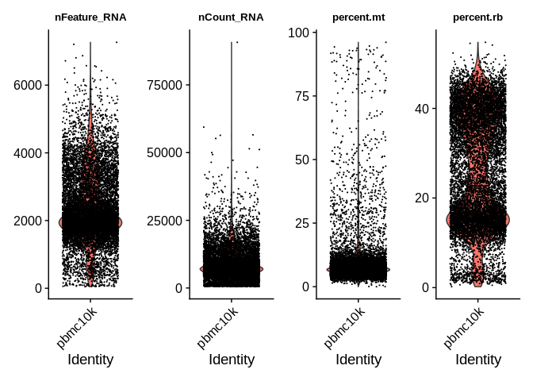<!-- -->
Any correlation between metadata features?

``` r
FeatureScatter(srat, feature1 = "nCount_RNA", feature2 = "percent.mt")
```

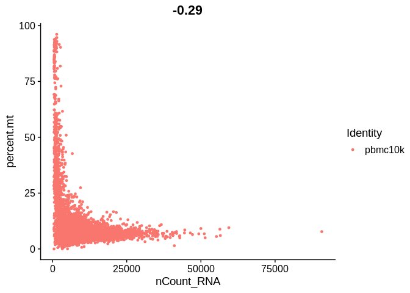<!-- -->

``` r
FeatureScatter(srat, feature1 = "nCount_RNA", feature2 = "nFeature_RNA")
```

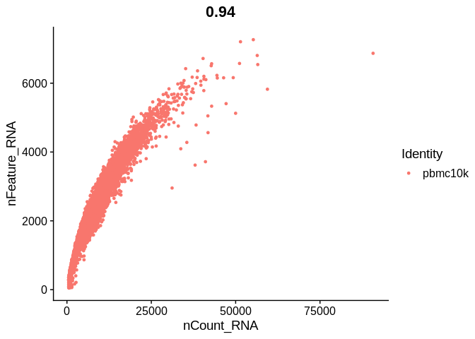<!-- -->

``` r
FeatureScatter(srat, feature1 = "nCount_RNA", feature2 = "percent.rb")
```

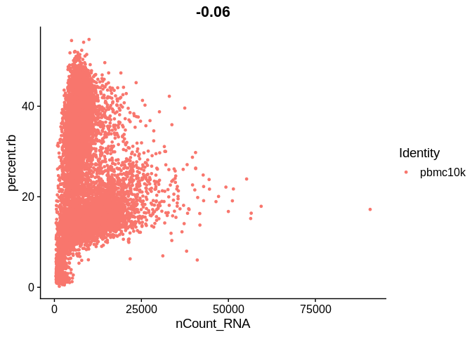<!-- -->

``` r
FeatureScatter(srat, feature1 = "percent.rb", feature2 = "percent.mt")
```

<!-- -->

``` r
FeatureScatter(srat, feature1 = "nFeature_RNA", feature2 = "Doublet_score")
```

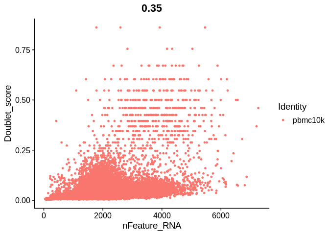<!-- -->

Set QC column in metadata

``` r
srat[['QC']] <- ifelse(srat@meta.data$Is_doublet == 'True', 'Doublet', 'Pass')
srat[['QC']] <- ifelse(srat@meta.data$nFeature_RNA < 500 & srat@meta.data$QC == 'Pass','Low_nFeature', srat@meta.data$QC)
srat[['QC']] <- ifelse(srat@meta.data$nFeature_RNA < 500 & srat@meta.data$QC != 'Pass' & srat@meta.data$QC != 'Low_nFeature', paste('Low_nFeature', srat@meta.data$QC, sep = ','), srat@meta.data$QC)
srat[['QC']] <- ifelse(srat@meta.data$percent.mt > 15 & srat@meta.data$QC == 'Pass','High_MT',srat@meta.data$QC)
srat[['QC']] <- ifelse(srat@meta.data$nFeature_RNA < 500 & srat@meta.data$QC != 'Pass' & srat@meta.data$QC != 'High_MT',paste('High_MT',srat@meta.data$QC,sep = ','),srat@meta.data$QC)
table(srat[['QC']])
```

    ## QC
    ##                      Doublet                      High_MT 
    ##                          546                          548 
    ##         High_MT,Low_nFeature High_MT,Low_nFeature,Doublet 
    ##                          275                            1 
    ##                         Pass 
    ##                         8824

Plot only cells that pass (tentative) QC:

``` r
VlnPlot(subset(srat, subset = QC == 'Pass'), 
        features = c("nFeature_RNA", "nCount_RNA", "percent.mt", "percent.rb"), 
        ncol = 4,
        pt.size = 0.1) &
  theme(plot.title = element_text(size=10))
```

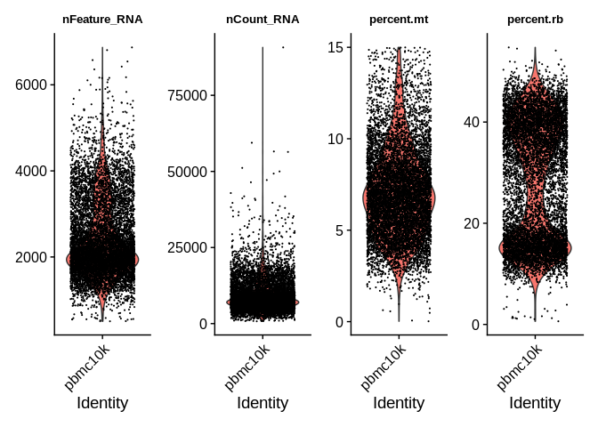<!-- -->

### Normalization, dimensionality reduction

Conventional way to normalize data: scale as if all cells have 10K UMIs
overall, and log2-transform the values.

``` r
srat <- NormalizeData(srat)
```

Find most variable features (genes).

``` r
srat <- FindVariableFeatures(srat, selection.method = "vst", nfeatures = 2000)
```

Show the top 10 most highly variable genes.

``` r
top10 <- head(VariableFeatures(srat), 10)
top10
```

    ##  [1] "PTGDS"  "IGLC3"  "PPBP"   "CXCL10" "GZMB"   "GP1BB"  "JCHAIN" "FCER1A"
    ##  [9] "IGKC"   "MZB1"

``` r
plot1 <- VariableFeaturePlot(srat)
LabelPoints(plot = plot1, points = top10, repel = TRUE, xnudge = 0, ynudge = 0)
```

    ## Warning: Transformation introduced infinite values in continuous x-axis

    ## Warning: Removed 11407 rows containing missing values (geom_point).

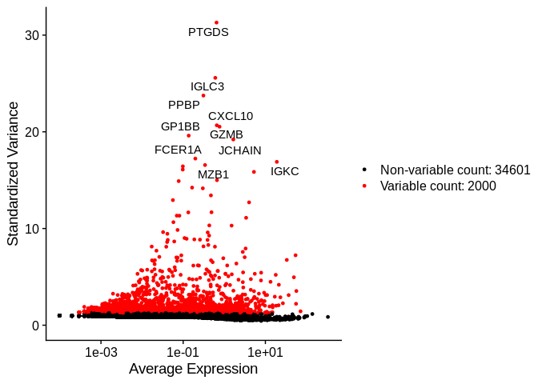<!-- -->

Before running PCA, need to scale data to Z-scores.

``` r
all.genes <- rownames(srat)
srat <- ScaleData(srat, features = all.genes)
```

    ## Centering and scaling data matrix

PCA on 2000 most variable genes (default setting).

``` r
srat <- RunPCA(srat, features = VariableFeatures(object = srat))
```

    ## PC_ 1 
    ## Positive:  FCN1, CST3, LYZ, FGL2, IFI30, MNDA, CTSS, TYMP, TYROBP, SERPINA1 
    ##     TMEM176B, CYBB, S100A9, PSAP, NCF2, LST1, SPI1, AIF1, IGSF6, CD68 
    ##     CSTA, GRN, TNFSF13B, CFD, S100A8, MPEG1, MS4A6A, FCER1G, CFP, DUSP6 
    ## Negative:  LTB, IL32, TRAC, TRBC2, IL7R, CD7, LIME1, ARL4C, CD27, PRKCQ-AS1 
    ##     CCR7, FCMR, CD247, LEF1, CD69, TRBC1, GZMM, MAL, TRABD2A, BCL2 
    ##     SYNE2, ISG20, CTSW, IKZF3, ITM2A, RORA, AQP3, TRAT1, CD8B, KLRK1 
    ## PC_ 2 
    ## Positive:  IGHM, MS4A1, CD79A, BANK1, SPIB, NIBAN3, BCL11A, IGKC, CD79B, LINC00926 
    ##     TCF4, RALGPS2, AFF3, TNFRSF13C, IGHD, HLA-DQA1, TSPAN13, BLNK, CD22, PAX5 
    ##     BLK, COBLL1, VPREB3, FCER2, JCHAIN, FCRLA, GNG7, HLA-DOB, TCL1A, LINC02397 
    ## Negative:  IL32, TRAC, CD7, IL7R, CD247, GZMM, ANXA1, CTSW, S100A4, PRKCQ-AS1 
    ##     TRBC1, S100A10, ITGB2, LEF1, KLRK1, RORA, GZMA, S100A6, NEAT1, MAL 
    ##     CST7, NKG7, ID2, TRBC2, ARL4C, MT2A, SAMD3, PRF1, LIME1, TRAT1 
    ## PC_ 3 
    ## Positive:  GZMB, CLIC3, C12orf75, LILRA4, NKG7, CLEC4C, SERPINF1, CST7, GZMA, GNLY 
    ##     SCT, LRRC26, DNASE1L3, PRF1, TPM2, KLRD1, FGFBP2, CTSC, PACSIN1, IL3RA 
    ##     HOPX, CCL5, PLD4, LINC00996, GZMH, CCL4, MAP1A, SMPD3, TNFRSF21, PTCRA 
    ## Negative:  MS4A1, CD79A, LINC00926, BANK1, TNFRSF13C, IGHD, PAX5, RALGPS2, VPREB3, CD22 
    ##     FCER2, CD79B, HLA-DOB, FCRL1, P2RX5, CD24, ARHGAP24, ADAM28, CCR7, SWAP70 
    ##     FCRLA, LINC02397, CD19, IGHM, CD40, PKIG, FCRL2, BASP1, POU2AF1, BLK 
    ## PC_ 4 
    ## Positive:  NKG7, GNLY, CST7, PRF1, KLRD1, GZMA, FGFBP2, HOPX, CCL4, FCGR3A 
    ##     KLRF1, GZMH, CCL5, SPON2, CD160, ADGRG1, PTGDR, LAIR2, TRDC, RHOC 
    ##     IFITM2, ABI3, MATK, TBX21, IL2RB, XCL2, PRSS23, FCRL6, CTSW, S1PR5 
    ## Negative:  LILRA4, SERPINF1, CLEC4C, SCT, LRRC26, DNASE1L3, TPM2, MAP1A, TNFRSF21, PACSIN1 
    ##     LINC00996, SCN9A, PTCRA, EPHB1, ITM2C, SMIM5, LAMP5, DERL3, CIB2, APP 
    ##     IL3RA, SMPD3, PLEKHD1, SCAMP5, PLD4, ZFAT, PPM1J, GAS6, LGMN, TLR9 
    ## PC_ 5 
    ## Positive:  S100A12, VCAN, ITGAM, CES1, S100A8, CYP1B1, PADI4, MGST1, MEGF9, MCEMP1 
    ##     QPCT, GNLY, CD14, RNASE2, CSF3R, RBP7, NKG7, KLRD1, VNN2, CLEC4E 
    ##     CRISPLD2, THBS1, PRF1, CST7, CKAP4, BST1, CTSD, CR1, FGFBP2, PGD 
    ## Negative:  CDKN1C, HES4, CTSL, BATF3, TCF7L2, SIGLEC10, CSF1R, CKB, MS4A7, CALML4 
    ##     FCGR3A, CASP5, RRAS, AC064805.1, MS4A4A, NEURL1, AC104809.2, IFITM3, MTSS1, SMIM25 
    ##     CAMK1, GPBAR1, ABI3, HMOX1, ZNF703, FAM110A, RHOC, CXCL16, CALHM6, RNASET2

Expectation for “well-behaved” datasets: PC “loadings” match markers of
distinct populations (in this case, cell types).

``` r
VizDimLoadings(srat, dims = 1:9, reduction = "pca") & 
  theme(axis.text=element_text(size=5), axis.title=element_text(size=8,face="bold"))
```

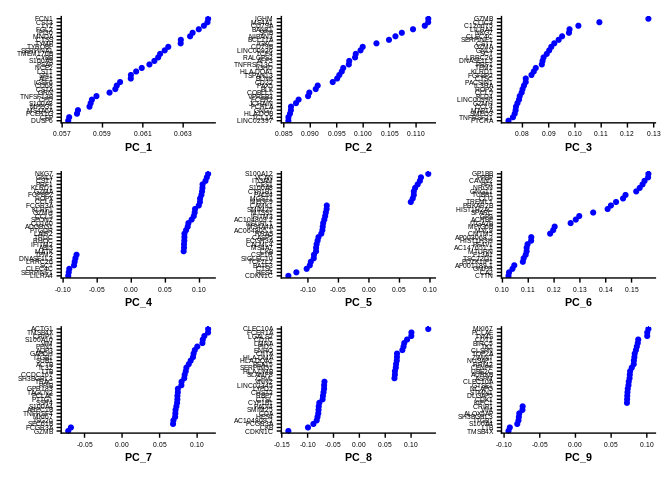<!-- -->

Can also visualize these as heatmaps.

``` r
DimHeatmap(srat, dims = 1:6, nfeatures = 20, cells = 500, balanced = T)
```

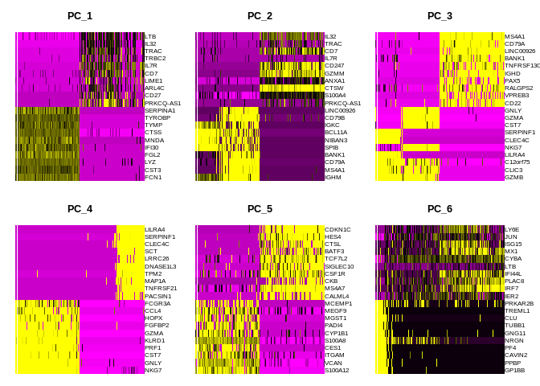<!-- -->

DimPlot is used to visualize all reduced representations. It tries UMAP,
then t-SNE, then PCA.

``` r
DimPlot(srat, reduction = "pca")
```

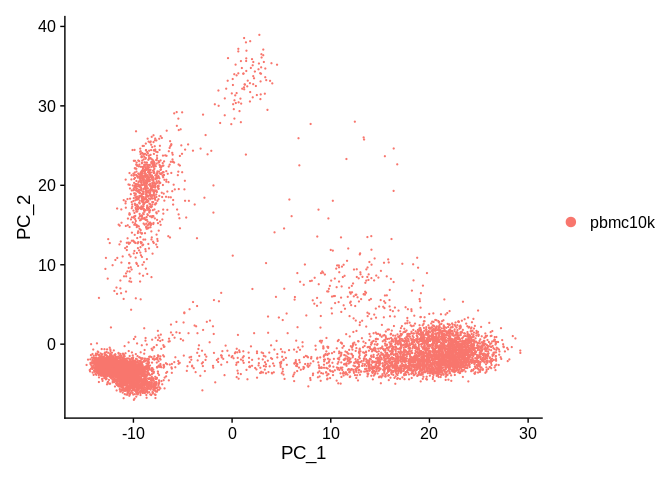<!-- -->

How many PCs can be used without (too) much information loss?

``` r
ElbowPlot(srat)
```

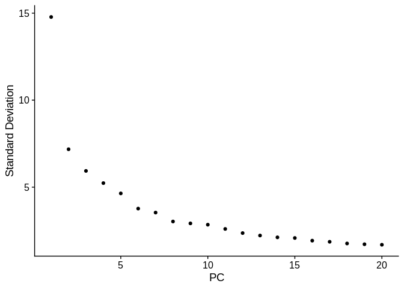<!-- -->

Onto clustering. Higher resolution = more clusters (typically). It’s
important to find the correct cluster resolution because cell type
markers depend on cluster definition.

``` r
srat <- FindNeighbors(srat, dims = 1:10)
```

    ## Computing nearest neighbor graph

    ## Computing SNN

``` r
srat <- FindClusters(srat, resolution = 0.5)
```

    ## Modularity Optimizer version 1.3.0 by Ludo Waltman and Nees Jan van Eck
    ## 
    ## Number of nodes: 10194
    ## Number of edges: 337796
    ## 
    ## Running Louvain algorithm...
    ## Maximum modularity in 10 random starts: 0.9082
    ## Number of communities: 13
    ## Elapsed time: 1 seconds

``` r
srat <- RunUMAP(srat, dims = 1:10, verbose = F)
```

    ## Warning: The default method for RunUMAP has changed from calling Python UMAP via reticulate to the R-native UWOT using the cosine metric
    ## To use Python UMAP via reticulate, set umap.method to 'umap-learn' and metric to 'correlation'
    ## This message will be shown once per session

Check cluster sizes (how many cells in a particular cluster). The
*active identity* is reset to “seurat_clusters” in metadata.

``` r
table(srat@meta.data$seurat_clusters)
```

    ## 
    ##    0    1    2    3    4    5    6    7    8    9   10   11   12 
    ## 2854 1671 1163 1079  851  774  426  402  381  245  178  134   36

``` r
DimPlot(srat, label.size = 4, repel = T, label = T)
```

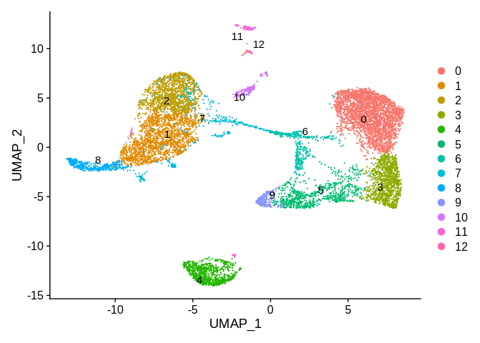<!-- -->

Beware of clustering artifacts! Look at two minor cell populations: (1)
dendritic cells (DCs) and (2) platelets. Visualize known markers for
these cells: DCs express LILRA4, TPM2; platelets express PPBP, GP1BB.

``` r
FeaturePlot(srat, features = c("LILRA4", "TPM2", "PPBP", "GP1BB"))
```

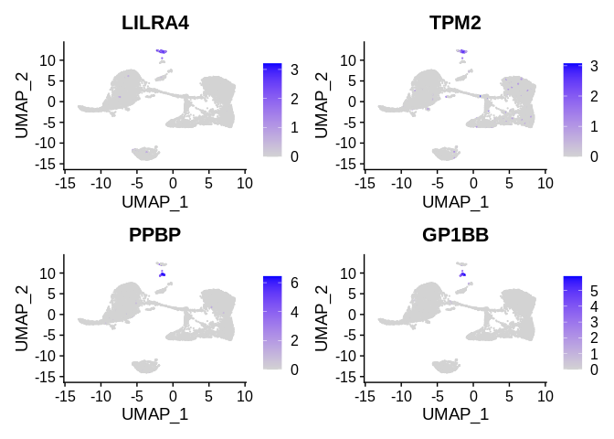<!-- -->

Visualize other confounders.

``` r
FeaturePlot(srat, features = "Doublet_score") & theme(plot.title = element_text(size=10))
```

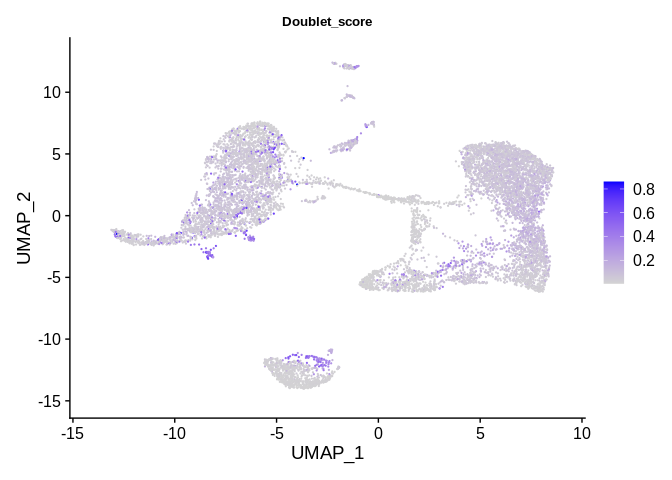<!-- -->

``` r
FeaturePlot(srat, features = "percent.mt") & theme(plot.title = element_text(size=10))
```

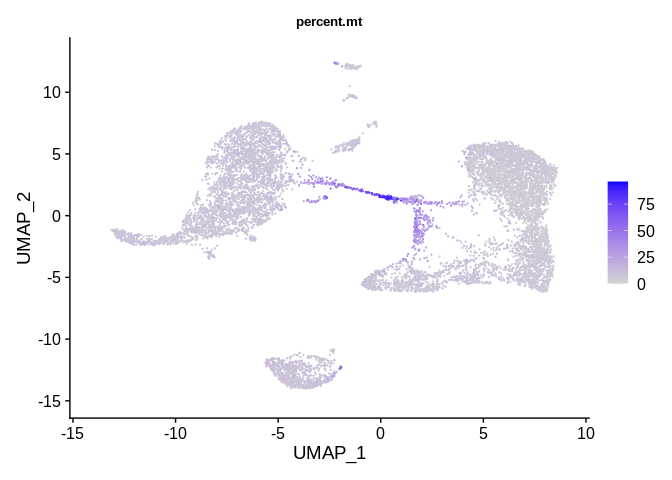<!-- -->

``` r
FeaturePlot(srat, features = "nFeature_RNA") & theme(plot.title = element_text(size=10))
```

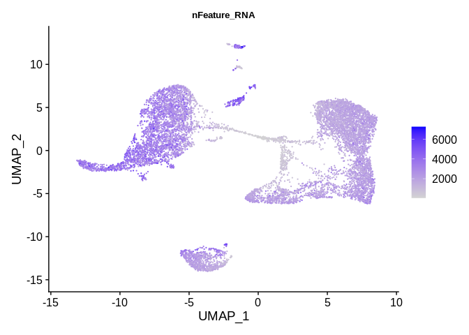<!-- -->

Remove the cells that did not pass QC and compare to earlier plot.

``` r
srat <- subset(srat, subset = QC == 'Pass')
DimPlot(srat,label.size = 4,repel = T,label = T)
```

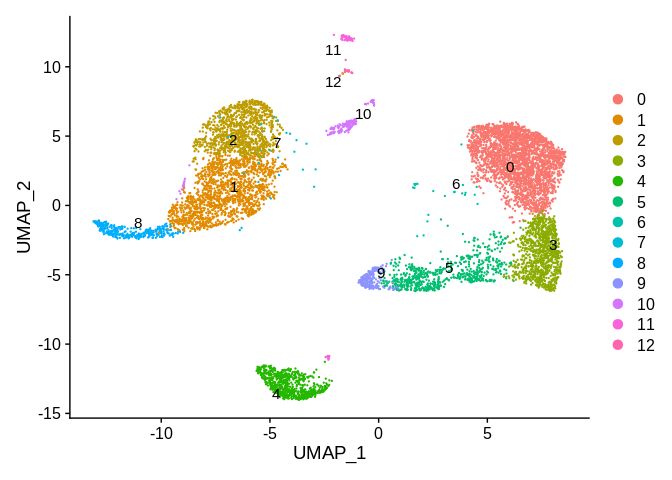<!-- -->

Do some housekeeping so R doesn’t break.

``` r
remove(all.genes)
gc()
```

    ##             used   (Mb) gc trigger   (Mb)   max used   (Mb)
    ## Ncells   9075424  484.7   15755990  841.5   15755990  841.5
    ## Vcells 404570946 3086.7 1258658009 9602.8 1043389169 7960.5

Calculate cell cycle scores.

``` r
s.genes <- cc.genes.updated.2019$s.genes
g2m.genes <- cc.genes.updated.2019$g2m.genes

srat <- CellCycleScoring(srat, s.features = s.genes, g2m.features = g2m.genes) # note this will only run on normalized data
table(srat[[]]$Phase)
```

    ## 
    ##   G1  G2M    S 
    ## 5431  977 2416

Clean up some more.

``` r
remove(s.genes)
remove(g2m.genes)
gc()
```

    ##             used   (Mb) gc trigger   (Mb)   max used   (Mb)
    ## Ncells   9081952  485.1   15755990  841.5   15755990  841.5
    ## Vcells 404612333 3087.0 1258658009 9602.8 1043389169 7960.5

Check if any of the clusters are defined by technical differences.

``` r
FeaturePlot(srat,features = "percent.mt",label.size = 4,repel = T,label = T) & 
  theme(plot.title = element_text(size=10))
```

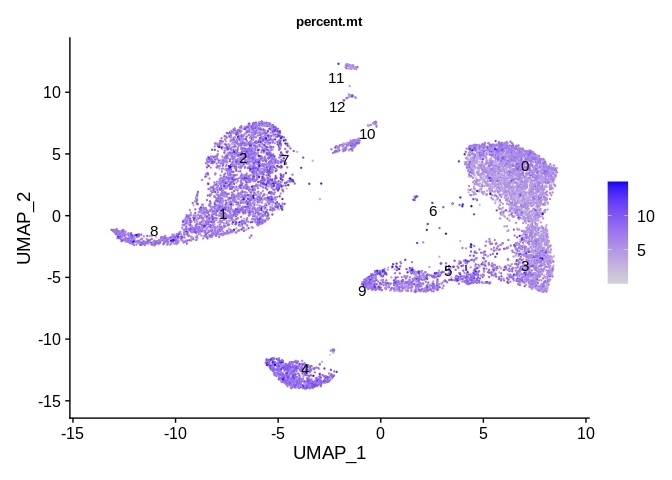<!-- -->

``` r
VlnPlot(srat, features = "percent.mt") & theme(plot.title = element_text(size = 10))
```

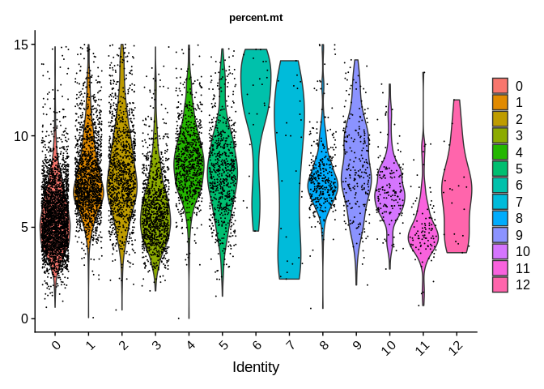<!-- -->

``` r
FeaturePlot(srat,features = "percent.rb",label.size = 4,repel = T,label = T) & theme(plot.title = element_text(size=10))
```

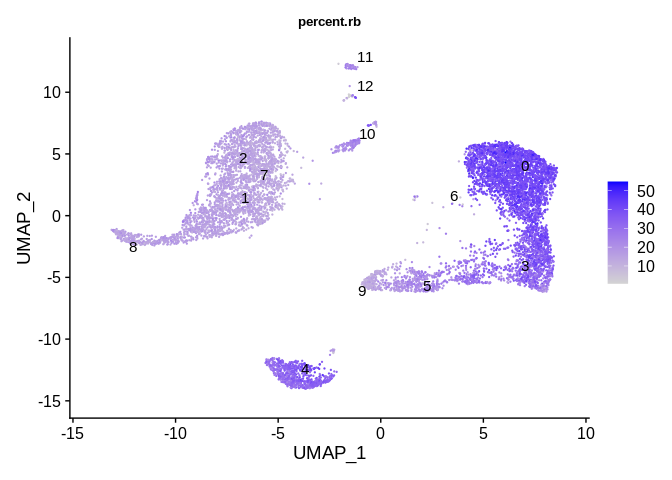<!-- -->

``` r
VlnPlot(srat,features = "percent.rb") & theme(plot.title = element_text(size=10))
```

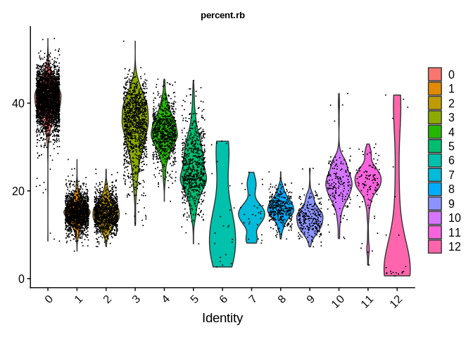<!-- -->

``` r
VlnPlot(srat,features = c("nCount_RNA","nFeature_RNA")) & 
  theme(plot.title = element_text(size=10))
```

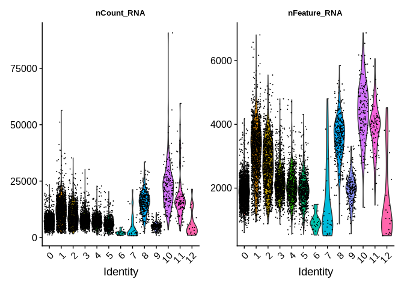<!-- -->

``` r
FeaturePlot(srat,features = c("S.Score","G2M.Score"),label.size = 4,repel = T,label = T) & 
  theme(plot.title = element_text(size=10))
```

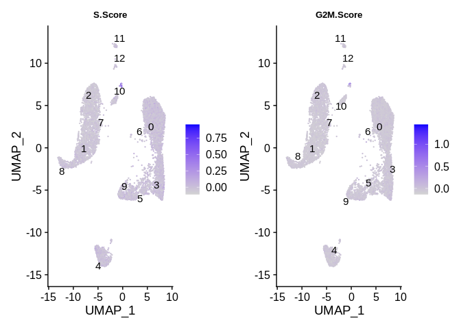<!-- -->

``` r
VlnPlot(srat,features = c("S.Score","G2M.Score")) & 
  theme(plot.title = element_text(size=10))
```

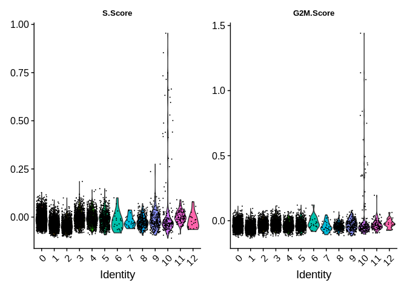<!-- -->

### SCTransform normalization and clustering

Single SCTransform command replaces `NormalizeData`, `ScaleData`, and
`FindVariableFeatures`. Also correct for % mitochondrial genes and cell
cycle scores using `vars.to.regress`.

``` r
srat <- SCTransform(srat, method = "glmGamPoi", ncells = 8824, 
                    vars.to.regress = c("percent.mt", "S.Score", "G2M.Score"), verbose = F)
srat
```

    ## An object of class Seurat 
    ## 56857 features across 8824 samples within 2 assays 
    ## Active assay: SCT (20256 features, 3000 variable features)
    ##  1 other assay present: RNA
    ##  2 dimensional reductions calculated: pca, umap

PCA, UMAP, and clustering.

``` r
srat <- RunPCA(srat, verbose = F)
srat <- RunUMAP(srat, dims = 1:30, verbose = F)
srat <- FindNeighbors(srat, dims = 1:30, verbose = F)
srat <- FindClusters(srat, verbose = F)
table(srat[[]]$seurat_clusters)
```

    ## 
    ##    0    1    2    3    4    5    6    7    8    9   10   11   12   13   14   15 
    ## 1758 1557 1214 1054  933  381  330  312  302  268  249  132  109  105  102   18

``` r
DimPlot(srat, label=T)
```

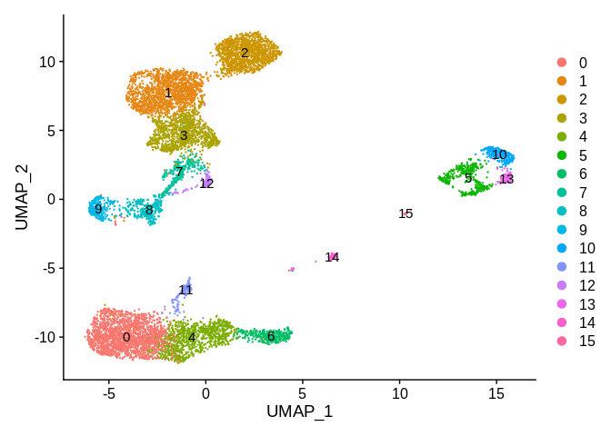<!-- -->

Check that clusters seem *reasonable* by visualizing where certain cell
type markers are, e.g., dendritic cells (PPBP, LILRA4).

``` r
FeaturePlot(srat,"PPBP") & 
  scale_colour_gradientn(colours = rev(brewer.pal(n = 11, name = "Spectral")))
```

    ## Scale for 'colour' is already present. Adding another scale for 'colour',
    ## which will replace the existing scale.

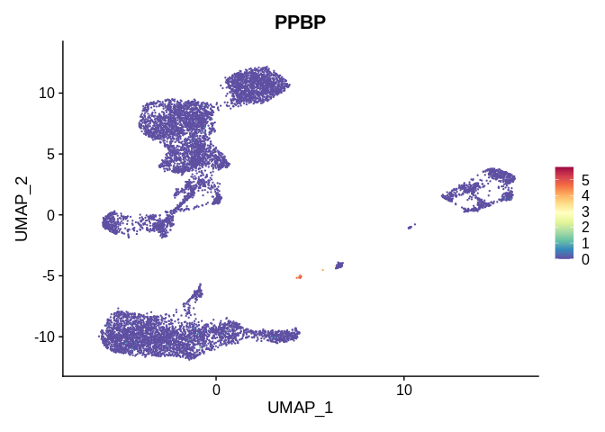<!-- -->

``` r
FeaturePlot(srat,"LILRA4") & 
  scale_colour_gradientn(colours = rev(brewer.pal(n = 11, name = "Spectral")))
```

    ## Scale for 'colour' is already present. Adding another scale for 'colour',
    ## which will replace the existing scale.

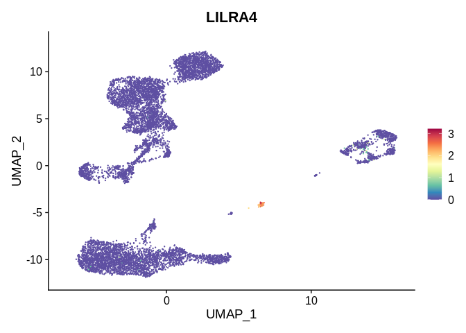<!-- -->

``` r
srat <- FindNeighbors(srat, dims = 1:30, k.param = 15, verbose = F)
```

``` r
srat <- FindClusters(srat, verbose = F, algorithm = 4, resolution = 0.9, method = "igraph")
gc()
```

    ##             used   (Mb) gc trigger   (Mb)   max used   (Mb)
    ## Ncells  10942488  584.4   23565712 1258.6   23565712 1258.6
    ## Vcells 500667346 3819.8 1258658009 9602.8 1258657044 9602.8

``` r
table(srat[[]]$seurat_clusters)
```

    ## 
    ##    1    2    3    4    5    6    7    8    9   10   11   12   13 
    ## 1753 1559 1219 1049  936  421  399  354  344  301  269  133   87

``` r
DimPlot(srat, label = T)
```

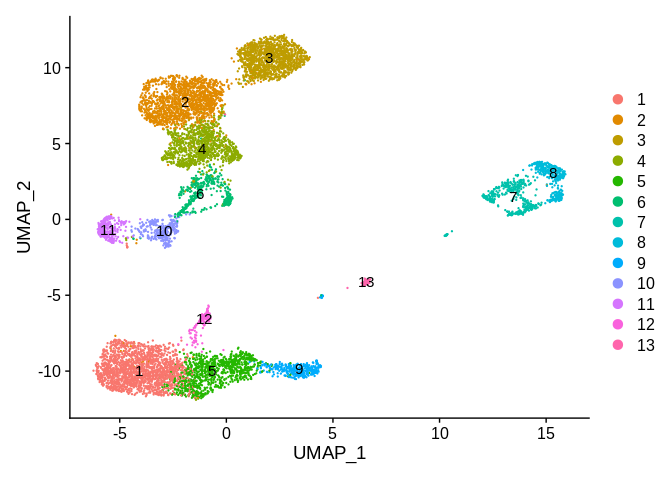<!-- -->

Use more cell type markers to identify clusters.

``` r
FeaturePlot(srat,"MS4A1") + 
  scale_colour_gradientn(colours = rev(brewer.pal(n = 11, name = "Spectral"))) + ggtitle("MS4A1: B cells")
```

    ## Scale for 'colour' is already present. Adding another scale for 'colour',
    ## which will replace the existing scale.

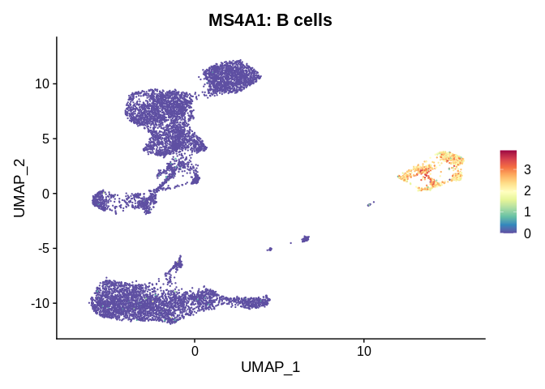<!-- -->

``` r
FeaturePlot(srat,"LYZ") + 
  scale_colour_gradientn(colours = rev(brewer.pal(n = 11, name = "Spectral"))) + ggtitle("LYZ: monocytes")
```

    ## Scale for 'colour' is already present. Adding another scale for 'colour',
    ## which will replace the existing scale.

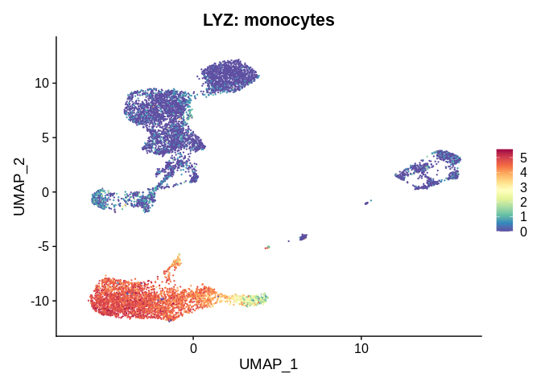<!-- -->

``` r
FeaturePlot(srat,"NKG7") + 
  scale_colour_gradientn(colours = rev(brewer.pal(n = 11, name = "Spectral"))) + ggtitle("NKG7: natural killers")
```

    ## Scale for 'colour' is already present. Adding another scale for 'colour',
    ## which will replace the existing scale.

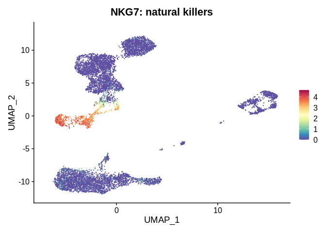<!-- -->

``` r
FeaturePlot(srat,"CD8B") + 
  scale_colour_gradientn(colours = rev(brewer.pal(n = 11, name = "Spectral"))) + ggtitle("CD8B: CD8 T cells")
```

    ## Scale for 'colour' is already present. Adding another scale for 'colour',
    ## which will replace the existing scale.

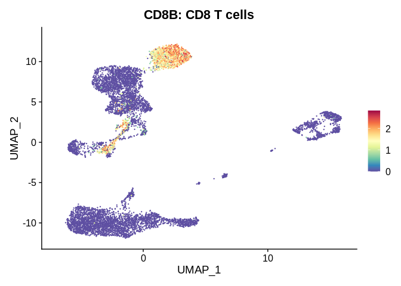<!-- -->

``` r
FeaturePlot(srat,"IL7R") + 
  scale_colour_gradientn(colours = rev(brewer.pal(n = 11, name = "Spectral"))) + ggtitle("IL7R: CD4 T cells")
```

    ## Scale for 'colour' is already present. Adding another scale for 'colour',
    ## which will replace the existing scale.

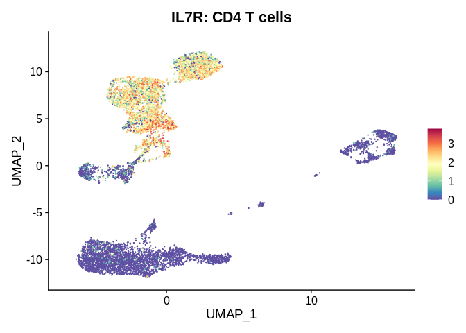<!-- -->

### Differential expression and marker selection

It’s recommended to do DE analysis on the `RNA` and not the
`SCTransform` data. Can do DE between two clusters, or one cluster vs
the rest of the cells.

Set active assay back to RNA, redo normalization and scaling.
\[Interesting that we need to go back and forth between the RNA and
SCTransform data. This seems inefficient to me.\]

``` r
DefaultAssay(srat) <- "RNA"
srat <- NormalizeData(srat)
gc()
```

    ##             used   (Mb) gc trigger   (Mb)   max used   (Mb)
    ## Ncells   9184263  490.5   23565712 1258.6   23565712 1258.6
    ## Vcells 492473139 3757.3 1258658009 9602.8 1258657044 9602.8

``` r
srat <- FindVariableFeatures(srat, selection.method = "vst", nfeatures = 2000)
gc()
```

    ##             used   (Mb) gc trigger   (Mb)   max used   (Mb)
    ## Ncells   9184246  490.5   23565712 1258.6   23565712 1258.6
    ## Vcells 492473153 3757.3 1258658009 9602.8 1258657044 9602.8

``` r
srat <- ScaleData(srat, features = rownames(srat))
```

    ## Centering and scaling data matrix

``` r
gc()
```

    ##             used   (Mb) gc trigger   (Mb)   max used   (Mb)
    ## Ncells   9184252  490.5   23565712 1258.6   23565712 1258.6
    ## Vcells 492473190 3757.3 1258658009 9602.8 1258657044 9602.8

Find markers for every cluster. Modify only.pos, min.pct and
logfc.threshold as needed.

``` r
all.markers <- FindAllMarkers(srat, only.pos = T, min.pct = 0.5, logfc.threshold = 0.5)
```

    ## Calculating cluster 1

    ## Calculating cluster 2

    ## Calculating cluster 3

    ## Calculating cluster 4

    ## Calculating cluster 5

    ## Calculating cluster 6

    ## Calculating cluster 7

    ## Calculating cluster 8

    ## Calculating cluster 9

    ## Calculating cluster 10

    ## Calculating cluster 11

    ## Calculating cluster 12

    ## Calculating cluster 13

``` r
dim(all.markers)
```

    ## [1] 3527    7

``` r
gc()
```

    ##             used   (Mb) gc trigger   (Mb)   max used   (Mb)
    ## Ncells   9239747  493.5   23565712 1258.6   23565712 1258.6
    ## Vcells 492598697 3758.3 1258658009 9602.8 1258657044 9602.8

``` r
table(all.markers$cluster)
```

    ## 
    ##   1   2   3   4   5   6   7   8   9  10  11  12  13 
    ## 543 135 131  76 529  76 143 155 451 186 261 249 592

``` r
top3_markers <- as.data.frame(all.markers %>% group_by(cluster) %>% top_n(n = 3, wt = avg_log2FC))
top3_markers
```

    ##            p_val avg_log2FC pct.1 pct.2     p_val_adj cluster      gene
    ## 1   0.000000e+00   4.512286 0.990 0.177  0.000000e+00       1    S100A8
    ## 2   0.000000e+00   4.269776 0.990 0.200  0.000000e+00       1    S100A9
    ## 3   0.000000e+00   3.272310 0.963 0.116  0.000000e+00       1   S100A12
    ## 4   0.000000e+00   1.264989 0.906 0.357  0.000000e+00       2      TCF7
    ## 5   0.000000e+00   1.217024 0.826 0.272  0.000000e+00       2      CCR7
    ## 6  1.387832e-211   1.284090 0.684 0.296 5.079605e-207       2     TRBC1
    ## 7   0.000000e+00   2.506294 0.981 0.068  0.000000e+00       3      CD8B
    ## 8   0.000000e+00   1.775931 0.678 0.022  0.000000e+00       3 LINC02446
    ## 9   0.000000e+00   1.642803 0.875 0.077  0.000000e+00       3      CD8A
    ## 10  0.000000e+00   1.644171 0.986 0.475  0.000000e+00       4      IL32
    ## 11  0.000000e+00   1.612145 0.992 0.653  0.000000e+00       4       LTB
    ## 12 1.511291e-271   1.443016 0.932 0.407 5.531477e-267       4      IL7R
    ## 13  0.000000e+00   2.184410 0.899 0.193  0.000000e+00       5  APOBEC3A
    ## 14  0.000000e+00   2.121784 0.974 0.291  0.000000e+00       5    MARCKS
    ## 15  0.000000e+00   2.115595 0.986 0.324  0.000000e+00       5    IFITM3
    ## 16  0.000000e+00   3.449087 0.879 0.022  0.000000e+00       6      GZMK
    ## 17  0.000000e+00   2.663332 0.945 0.109  0.000000e+00       6      CCL5
    ## 18  0.000000e+00   1.996870 0.848 0.115  0.000000e+00       6      GZMA
    ## 19  0.000000e+00   5.227462 0.561 0.013  0.000000e+00       7     IGHA1
    ## 20  0.000000e+00   4.995924 0.687 0.071  0.000000e+00       7      IGKC
    ## 21  0.000000e+00   3.327414 0.599 0.024  0.000000e+00       7    JCHAIN
    ## 22  0.000000e+00   4.363406 1.000 0.058  0.000000e+00       8      IGHM
    ## 23  0.000000e+00   3.760828 0.966 0.010  0.000000e+00       8     TCL1A
    ## 24  0.000000e+00   3.538592 0.986 0.029  0.000000e+00       8      IGHD
    ## 25  0.000000e+00   3.682228 0.959 0.139  0.000000e+00       9    FCGR3A
    ## 26  0.000000e+00   3.523522 0.881 0.027  0.000000e+00       9    CDKN1C
    ## 27 1.099210e-228   2.784140 0.971 0.371 4.023219e-224       9    IFITM3
    ## 28  0.000000e+00   3.908501 0.977 0.034  0.000000e+00      10      GZMH
    ## 29  0.000000e+00   3.752713 0.997 0.119  0.000000e+00      10      CCL5
    ## 30  0.000000e+00   3.742569 1.000 0.172  0.000000e+00      10      NKG7
    ## 31  0.000000e+00   5.240865 1.000 0.073  0.000000e+00      11      GNLY
    ## 32  0.000000e+00   4.204430 1.000 0.175  0.000000e+00      11      NKG7
    ## 33  0.000000e+00   3.845398 0.989 0.102  0.000000e+00      11      PRF1
    ## 34  0.000000e+00   2.773216 0.842 0.008  0.000000e+00      12    FCER1A
    ## 35 2.353340e-111   2.998625 0.992 0.298 8.613459e-107      12  HLA-DQA1
    ## 36  3.412537e-88   2.718089 1.000 0.495  1.249023e-83      12  HLA-DPB1
    ## 37  0.000000e+00   5.007699 0.575 0.012  0.000000e+00      13     PTGDS
    ## 38  0.000000e+00   3.819952 1.000 0.040  0.000000e+00      13    JCHAIN
    ## 39 5.661504e-292   4.360291 0.977 0.055 2.072167e-287      13      GZMB

### Cell type annotation using SingleR

Get reference datasets.

``` r
monaco.ref <- celldex::MonacoImmuneData()
```

    ## snapshotDate(): 2022-04-26

    ## see ?celldex and browseVignettes('celldex') for documentation

    ## loading from cache

    ## see ?celldex and browseVignettes('celldex') for documentation

    ## loading from cache

``` r
# other references to try in the future
# hpca.ref <- celldex::HumanPrimaryCellAtlasData()
# dice.ref <- celldex::DatabaseImmuneCellExpressionData()
```

Convert `Seurat` object to `sce` object.

``` r
sce <- as.SingleCellExperiment(DietSeurat(srat))
sce
```

    ## class: SingleCellExperiment 
    ## dim: 36601 8824 
    ## metadata(0):
    ## assays(2): counts logcounts
    ## rownames(36601): MIR1302-2HG FAM138A ... AC007325.4 AC007325.2
    ## rowData names(0):
    ## colnames(8824): AAACCCACATGTAACC-1 AAACCCAGTGAGTCAG-1 ...
    ##   TTTGTTGTCGTTATCT-1 TTTGTTGTCTTTGCTA-1
    ## colData names(18): orig.ident nCount_RNA ... SCT_snn_res.0.9 ident
    ## reducedDimNames(0):
    ## mainExpName: RNA
    ## altExpNames(1): SCT

Annotate.

``` r
monaco.main <- SingleR(test = sce,assay.type.test = 1,ref = monaco.ref,labels = monaco.ref$label.main)
monaco.fine <- SingleR(test = sce,assay.type.test = 1,ref = monaco.ref,labels = monaco.ref$label.fine)
```

``` r
gc()
```

    ##             used   (Mb) gc trigger   (Mb)   max used   (Mb)
    ## Ncells   9465033  505.5   23565712 1258.6   23565712 1258.6
    ## Vcells 498883624 3806.2 1258658009 9602.8 1258657044 9602.8

``` r
table(monaco.main$pruned.labels)
```

    ## 
    ##         B cells    CD4+ T cells    CD8+ T cells Dendritic cells       Monocytes 
    ##             740            2343            1404             202            2986 
    ##        NK cells     Progenitors         T cells 
    ##             305              18             725

``` r
table(monaco.fine$pruned.labels)
```

    ## 
    ##    Central memory CD8 T cells           Classical monocytes 
    ##                           158                          2453 
    ##   Effector memory CD8 T cells             Exhausted B cells 
    ##                            31                            33 
    ##     Follicular helper T cells        Intermediate monocytes 
    ##                           250                           348 
    ##                    MAIT cells       Myeloid dendritic cells 
    ##                           131                           137 
    ##                 Naive B cells             Naive CD4 T cells 
    ##                           354                          1236 
    ##             Naive CD8 T cells          Natural killer cells 
    ##                          1237                           294 
    ##       Non classical monocytes   Non-switched memory B cells 
    ##                           153                           253 
    ##            Non-Vd2 gd T cells                  Plasmablasts 
    ##                           150                            12 
    ##  Plasmacytoid dendritic cells              Progenitor cells 
    ##                            78                            15 
    ##       Switched memory B cells            T regulatory cells 
    ##                            82                           262 
    ## Terminal effector CD4 T cells Terminal effector CD8 T cells 
    ##                            42                            83 
    ##                     Th1 cells                Th1/Th17 cells 
    ##                           163                           212 
    ##                    Th17 cells                     Th2 cells 
    ##                           184                           220 
    ##                Vd2 gd T cells 
    ##                           157

Add annotations to `Seurat` object.

``` r
srat@meta.data$monaco.main <- monaco.main$pruned.labels
srat@meta.data$monaco.fine <- monaco.fine$pruned.labels
```

Visualize clusters with cell annotations.

``` r
srat <- SetIdent(srat, value = "monaco.fine")
DimPlot(srat, label = T , repel = T, label.size = 3) + NoLegend()
```

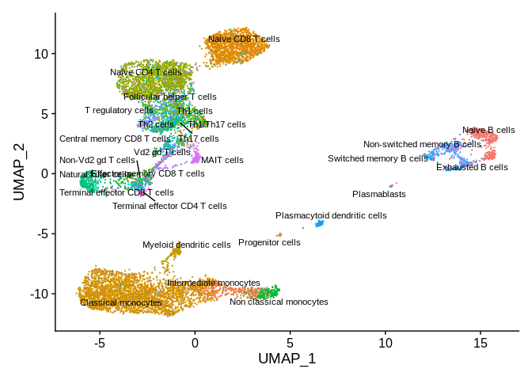<!-- -->

``` r
FeaturePlot(srat,"CD38") + scale_colour_gradientn(colours = rev(brewer.pal(n = 11, name = "Spectral")))
```

    ## Scale for 'colour' is already present. Adding another scale for 'colour',
    ## which will replace the existing scale.

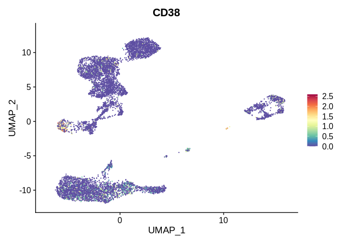<!-- -->

``` r
FeaturePlot(srat,"CD59") + scale_colour_gradientn(colours = rev(brewer.pal(n = 11, name = "Spectral")))
```

    ## Scale for 'colour' is already present. Adding another scale for 'colour',
    ## which will replace the existing scale.

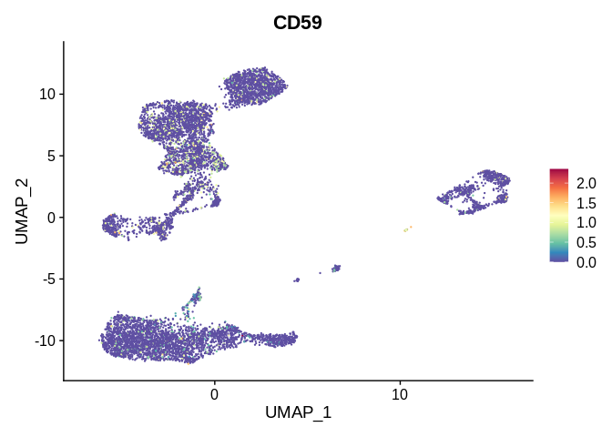<!-- -->

Cluster 13 supposedly consists of MAIT cells. Check where its markers
KLRB1 and CXCR6.

``` r
FeaturePlot(srat,"KLRB1") + scale_colour_gradientn(colours = rev(brewer.pal(n = 11, name = "Spectral")))
```

    ## Scale for 'colour' is already present. Adding another scale for 'colour',
    ## which will replace the existing scale.

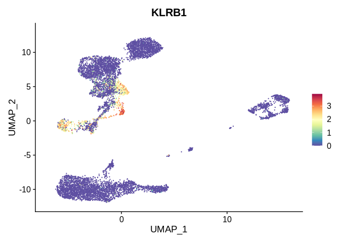<!-- -->

``` r
FeaturePlot(srat,"CXCR6") + scale_colour_gradientn(colours = rev(brewer.pal(n = 11, name = "Spectral")))
```

    ## Scale for 'colour' is already present. Adding another scale for 'colour',
    ## which will replace the existing scale.

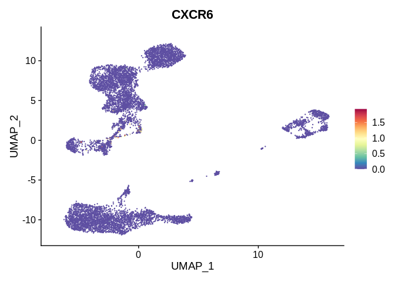<!-- -->

### Session info

``` r
sessionInfo()
```

    ## R version 4.2.1 (2022-06-23)
    ## Platform: x86_64-pc-linux-gnu (64-bit)
    ## Running under: Ubuntu 20.04.2 LTS
    ## 
    ## Matrix products: default
    ## BLAS:   /usr/lib/x86_64-linux-gnu/blas/libblas.so.3.9.0
    ## LAPACK: /usr/lib/x86_64-linux-gnu/lapack/liblapack.so.3.9.0
    ## 
    ## locale:
    ##  [1] LC_CTYPE=en_US.UTF-8       LC_NUMERIC=C              
    ##  [3] LC_TIME=en_US.UTF-8        LC_COLLATE=en_US.UTF-8    
    ##  [5] LC_MONETARY=en_US.UTF-8    LC_MESSAGES=en_US.UTF-8   
    ##  [7] LC_PAPER=en_US.UTF-8       LC_NAME=C                 
    ##  [9] LC_ADDRESS=C               LC_TELEPHONE=C            
    ## [11] LC_MEASUREMENT=en_US.UTF-8 LC_IDENTIFICATION=C       
    ## 
    ## attached base packages:
    ## [1] stats4    stats     graphics  grDevices utils     datasets  methods  
    ## [8] base     
    ## 
    ## other attached packages:
    ##  [1] SingleCellExperiment_1.18.0 RColorBrewer_1.1-3         
    ##  [3] celldex_1.6.0               dplyr_1.0.9                
    ##  [5] SingleR_1.10.0              SummarizedExperiment_1.26.1
    ##  [7] Biobase_2.56.0              GenomicRanges_1.48.0       
    ##  [9] GenomeInfoDb_1.32.2         IRanges_2.30.0             
    ## [11] S4Vectors_0.34.0            BiocGenerics_0.42.0        
    ## [13] MatrixGenerics_1.8.1        matrixStats_0.62.0         
    ## [15] ggplot2_3.3.6               sp_1.5-0                   
    ## [17] SeuratObject_4.1.0          Seurat_4.1.1               
    ## 
    ## loaded via a namespace (and not attached):
    ##   [1] utf8_1.2.2                    reticulate_1.25              
    ##   [3] tidyselect_1.1.2              RSQLite_2.2.14               
    ##   [5] AnnotationDbi_1.58.0          htmlwidgets_1.5.4            
    ##   [7] grid_4.2.1                    BiocParallel_1.30.3          
    ##   [9] Rtsne_0.16                    munsell_0.5.0                
    ##  [11] ScaledMatrix_1.4.0            codetools_0.2-18             
    ##  [13] ica_1.0-3                     future_1.26.1                
    ##  [15] miniUI_0.1.1.1                withr_2.5.0                  
    ##  [17] spatstat.random_2.2-0         colorspace_2.0-3             
    ##  [19] progressr_0.10.1              filelock_1.0.2               
    ##  [21] highr_0.11                    knitr_1.48                   
    ##  [23] rstudioapi_0.13               ROCR_1.0-11                  
    ##  [25] tensor_1.5                    listenv_0.8.0                
    ##  [27] labeling_0.4.2                GenomeInfoDbData_1.2.8       
    ##  [29] polyclip_1.10-0               farver_2.1.1                 
    ##  [31] bit64_4.0.5                   rprojroot_2.0.3              
    ##  [33] parallelly_1.32.0             vctrs_0.4.1                  
    ##  [35] generics_0.1.3                xfun_0.47                    
    ##  [37] BiocFileCache_2.4.0           R6_2.5.1                     
    ##  [39] ggbeeswarm_0.6.0              rsvd_1.0.5                   
    ##  [41] bitops_1.0-7                  spatstat.utils_2.3-1         
    ##  [43] cachem_1.0.6                  DelayedArray_0.22.0          
    ##  [45] assertthat_0.2.1              promises_1.2.0.1             
    ##  [47] scales_1.2.0                  rgeos_0.5-9                  
    ##  [49] beeswarm_0.4.0                gtable_0.3.0                 
    ##  [51] beachmat_2.12.0               globals_0.15.1               
    ##  [53] goftest_1.2-3                 rlang_1.1.4                  
    ##  [55] splines_4.2.1                 lazyeval_0.2.2               
    ##  [57] spatstat.geom_2.4-0           BiocManager_1.30.18          
    ##  [59] yaml_2.3.5                    reshape2_1.4.4               
    ##  [61] abind_1.4-5                   httpuv_1.6.5                 
    ##  [63] tools_4.2.1                   ellipsis_0.3.2               
    ##  [65] spatstat.core_2.4-4           ggridges_0.5.3               
    ##  [67] Rcpp_1.0.9                    plyr_1.8.7                   
    ##  [69] sparseMatrixStats_1.8.0       zlibbioc_1.42.0              
    ##  [71] purrr_0.3.4                   RCurl_1.98-1.7               
    ##  [73] rpart_4.1.16                  deldir_1.0-6                 
    ##  [75] pbapply_1.5-0                 cowplot_1.1.1                
    ##  [77] zoo_1.8-10                    ggrepel_0.9.1                
    ##  [79] cluster_2.1.3                 here_1.0.1                   
    ##  [81] magrittr_2.0.3                glmGamPoi_1.8.0              
    ##  [83] RSpectra_0.16-1               data.table_1.14.2            
    ##  [85] scattermore_0.8               lmtest_0.9-40                
    ##  [87] RANN_2.6.1                    fitdistrplus_1.1-8           
    ##  [89] patchwork_1.1.1               mime_0.12                    
    ##  [91] evaluate_0.15                 xtable_1.8-4                 
    ##  [93] gridExtra_2.3                 compiler_4.2.1               
    ##  [95] tibble_3.1.7                  KernSmooth_2.23-20           
    ##  [97] crayon_1.5.1                  htmltools_0.5.2              
    ##  [99] mgcv_1.8-40                   later_1.3.0                  
    ## [101] tidyr_1.2.0                   DBI_1.1.3                    
    ## [103] ExperimentHub_2.4.0           dbplyr_2.2.1                 
    ## [105] MASS_7.3-58                   rappdirs_0.3.3               
    ## [107] Matrix_1.4-1                  cli_3.3.0                    
    ## [109] parallel_4.2.1                igraph_1.3.2                 
    ## [111] pkgconfig_2.0.3               plotly_4.10.0                
    ## [113] spatstat.sparse_2.1-1         vipor_0.4.5                  
    ## [115] XVector_0.36.0                stringr_1.4.0                
    ## [117] digest_0.6.29                 sctransform_0.3.3            
    ## [119] RcppAnnoy_0.0.19              spatstat.data_2.2-0          
    ## [121] Biostrings_2.64.0             rmarkdown_2.28               
    ## [123] leiden_0.4.2                  uwot_0.1.11                  
    ## [125] DelayedMatrixStats_1.18.0     curl_4.3.2                   
    ## [127] shiny_1.7.1                   lifecycle_1.0.1              
    ## [129] nlme_3.1-157                  jsonlite_1.8.0               
    ## [131] BiocNeighbors_1.14.0          limma_3.52.2                 
    ## [133] viridisLite_0.4.0             fansi_1.0.3                  
    ## [135] pillar_1.7.0                  lattice_0.20-45              
    ## [137] ggrastr_1.0.1                 KEGGREST_1.36.3              
    ## [139] fastmap_1.1.0                 httr_1.4.3                   
    ## [141] survival_3.3-1                interactiveDisplayBase_1.34.0
    ## [143] glue_1.6.2                    png_0.1-7                    
    ## [145] BiocVersion_3.15.2            bit_4.0.4                    
    ## [147] stringi_1.7.8                 blob_1.2.3                   
    ## [149] BiocSingular_1.12.0           AnnotationHub_3.4.0          
    ## [151] memoise_2.0.1                 irlba_2.3.5                  
    ## [153] future.apply_1.9.0
